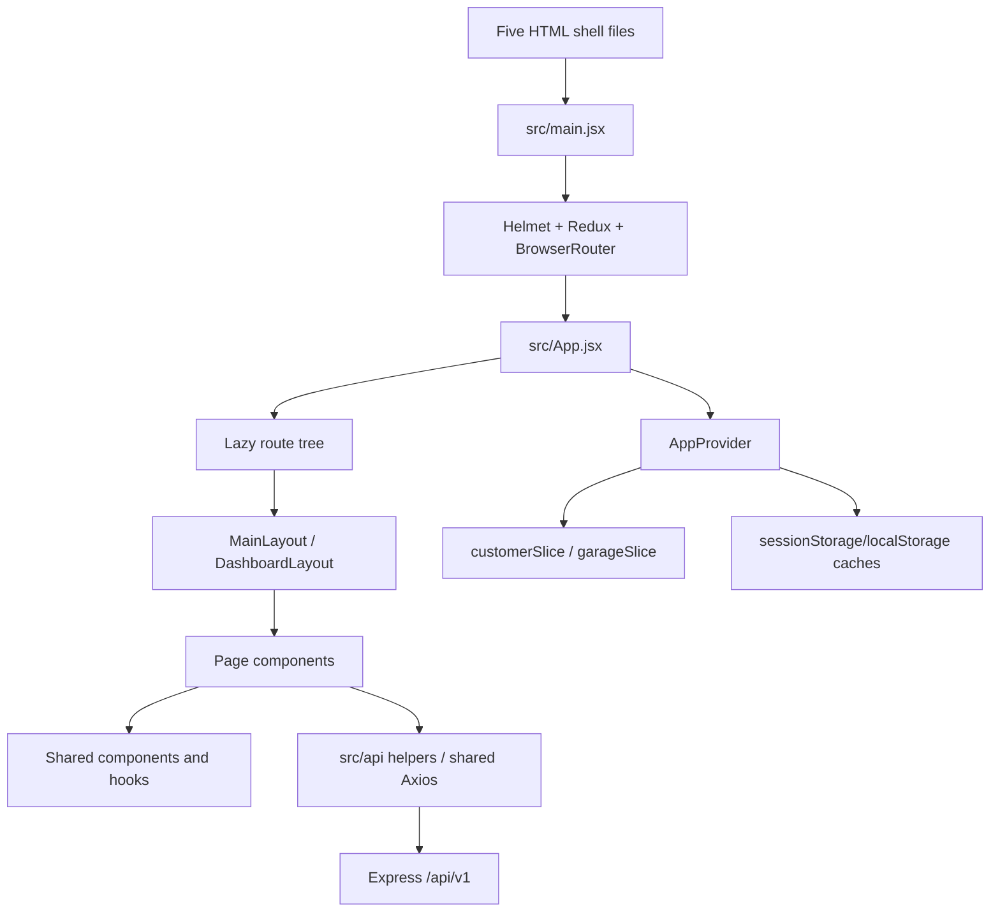

# Rovauto Client

The Rovauto client is a React 18 application for public visitors, customers, garage partners, customer-support agents, interns, and administrators. It is built once as five HTML/PWA entry documents, but every entry boots the same React route tree and shared state/API layer.

This README is frontend-specific. Use the repository [`README.md`](../README.md) for the full-stack quick start and `Detailed Schema.md` at the repository root for the standalone system guide.

## Confirmed frontend capabilities

- Public marketing, services, category, partner, contact, warranty, and platform-statistics pages
- Customer password, email/phone OTP, and Firebase Google authentication
- Required customer location and vehicle onboarding
- City/vehicle-aware service pricing, nearby-garage ranking preview, checkout, Cashfree modal payment, and wallet contribution
- Booking status, live route/tracking, handover OTP, inspection galleries, delivery acceptance, history, reviews, complaints, and support tickets
- Garage application, login, first-password change, services, booking requests, wallet, inspection, and tracking screens
- Admin, intern, and customer-support dashboards with role-specific navigation
- Installable customer/garage/support/admin/intern shells and Web Push support for customer, garage, and support accounts
- Global frontend error reporting, React error recovery, stale-chunk recovery, and Cloudinary image caching

## Stack

| Area | Implementation |
| --- | --- |
| UI | React 18.3, React DOM, React Icons, Framer Motion |
| Routing | React Router DOM 6 with lazy route modules and route guards |
| State | Redux Toolkit/React Redux plus `AppProvider` context and component-local state |
| HTTP | Axios with cookies, CSRF injection, GET retries, timeout handling, and issue reporting |
| Styling | Tailwind CSS 4 through `@tailwindcss/vite`, tokens/utilities in `src/index.css` |
| Metadata | React Helmet Async |
| Auth provider | Firebase client SDK for Google sign-in; backend owns the application session |
| Observability | Vercel Analytics, Speed Insights, and `/system-issues/report` |
| Build/hosting | Vite 5, Vercel, Firebase Hosting, or Docker/Nginx |

`zod`, React Hook Form, Formik, and Yup are not used by the client. Forms use controlled React state, HTML constraints, and page-specific validation.

## Frontend architecture



## Directory and file responsibilities

```text
client/
|-- public/                       Icons, manifests, service workers, static images, SEO files
|-- src/
|   |-- api/                      Shared Axios instance and domain API helpers
|   |-- assets/                   Images imported into the Vite bundle
|   |-- components/               Shared UI grouped by admin, booking, maps, PWA, reviews, etc.
|   |-- config/firebase.js        Firebase web-app initialization
|   |-- data/                     UI metadata/fallback constants (not the production catalog)
|   |-- hooks/                    AppProvider and notification/issue-count hooks
|   |-- layouts/                  Public and authenticated portal shells
|   |-- pages/                    Route-level components by public/auth/customer/garage/staff area
|   |-- store/                    Redux store, customer slice, and garage slice
|   |-- utils/                    Auth, cache, mapping, payment, activity, PWA, and error helpers
|   |-- App.jsx                   Lazy imports, route guards, navigation definitions, error boundary
|   |-- index.css                 Tailwind import, design tokens, and shared utilities
|   `-- main.jsx                  Browser entry point and root providers
|-- index.html                    Main/customer document shell
|-- support.html                  Customer-support document shell
|-- admin.html                    Admin document shell
|-- intern.html                   Intern document shell
|-- garage.html                   Garage document shell
|-- vite.config.js                Plugins, alias, build ID, and five Rollup inputs
|-- vercel.json                   Hosting rewrites, API proxy, caching, and security headers
|-- firebase.json                 Firebase Hosting configuration for all five shells
|-- nginx.conf                    Docker SPA/PWA routing and cache policy
|-- Dockerfile                    Node build stage plus Nginx runtime
|-- jsconfig.json                 `@/*` to `src/*` editor alias
|-- package.json                  npm scripts and dependencies
|-- package-lock.json             npm dependency lock
|-- bun.lock / bunfig.toml        Alternate Bun lock and 24-hour release-age policy
`-- .env.example                  Starting frontend environment template
```

## Entry point and document shells

`src/main.jsx`:

1. Reads `data-app-shell` from the active HTML document.
2. Captures the role-specific PWA install prompt.
3. Installs stale-chunk recovery and global error reporting.
4. Registers the correct production service worker for the current route.
5. Renders `App` inside `HelmetProvider`, Redux `Provider`, and `BrowserRouter`.

`vite.config.js` builds these inputs:

| Shell | HTML | Route prefix | Manifest | Service worker scope |
| --- | --- | --- | --- | --- |
| Main | `index.html` | `/` | `site.webmanifest` | `/` via `sw.js` |
| Support | `support.html` | `/support` | `support.webmanifest` | `/support` via `support-sw.js` |
| Admin | `admin.html` | `/admin` | `admin.webmanifest` | `/admin` via `admin-sw.js` |
| Intern | `intern.html` | `/intern` | `intern.webmanifest` | `/intern` via `intern-sw.js` |
| Garage | `garage.html` | `/garage` | `garage.webmanifest` | `/garage` via `garage-sw.js` |

`PwaDocumentShellGuard` in `src/App.jsx` reloads when a route was served by the wrong HTML shell. Correct static-host rewrites are still required; the guard is a recovery mechanism, not a hosting configuration replacement.

## Routes, layouts, and navigation

All route declarations and sidebar item arrays live in `src/App.jsx`.

### Public and authentication

```text
/
/services
/services/:categoryId
/how-it-works
/about
/partner
/contact
/warranty
/login
/register
/otp
/forgot
/reset-password                  redirects to /forgot
/admin/login
/intern/login
/support/login
/garage/login
/garage/otp-login
/garage/forgot-password
/garage/first-login
/garage/onboarding
/garage/magic/:id
/garage/requests/:id             same garage request page as the magic URL
```

`MainLayout` renders `Navbar`, the nested route `Outlet`, `Footer`, and the floating customer assistant.

### Customer booking and portal

```text
/garages                         protected ranked-garage preview
/booking/address
/booking/vehicle
/booking/services
/booking/garage                  ranking preview; selection is not reserved
/checkout
/tracking
/dashboard
/dashboard/vehicles
/dashboard/bookings
/dashboard/pending-bookings
/dashboard/history
/dashboard/payments
/dashboard/notifications
/dashboard/support
/dashboard/profile
```

`AddressCheck` requires a usable saved India location. `VehicleCheck` requires at least one vehicle. The backend repeats the important validation, so these guards improve navigation but are not security boundaries.

### Garage portal

```text
/garage
/garage/bookings
/garage/bookings/:id
/garage/services
/garage/wallet
/garage/profile
/garage/settings
```

### Admin portal

```text
/admin
/admin/customers
/admin/cars
/admin/services
/admin/garages
/admin/bookings
/admin/pending-bookings
/admin/revenue
/admin/payments
/admin/system-issues
/admin/support-tickets
/admin/customer-support-accounts
/admin/intern-accounts
/admin/dangerous
```

### Intern portal

```text
/intern
/intern/customers
/intern/services
/intern/garages
/intern/bookings
/intern/pending-bookings
/intern/revenue
/intern/system-issues
```

Intern routes reuse selected admin page components. The backend decides which reads/mutations an intern may perform.

### Customer-support portal

```text
/support
/support/tickets
/support/notify
/support/notifications           compatibility view of the same support notifications
/support/email
```

### SOS

```text
/sos
/sos/location
/sos/checkout
/sos/success
```

The inline `SOSAvailabilityGuard` loads service categories and blocks the flow when roadside assistance is marked coming soon. The SOS API still requires a customer session.

`DashboardLayout` supplies desktop/mobile navigation, logout behavior, unread badges, route preloading, portal branding, and a nested `Outlet`. It displays the floating assistant only in the customer portal.

## Important component relationships

| Area | Main modules | Relationship |
| --- | --- | --- |
| Public shell | `MainLayout`, `Navbar`, `Footer`, `FAB`, `ChatbotPopup` | Shared marketing/navigation chrome and customer assistant |
| Auth/session | auth pages, `useApp.jsx`, `authSession.js`, `googleAuth.js` | Pages call backend/Firebase; AppProvider verifies and exposes the server session |
| Booking | `AddressForm`, `VehicleSelect`, `ServiceSelect`, `GarageSelect`, `Checkout`, `Tracking` | Sequentially prepares location, vehicle, cart, candidate preview, payment, and status tracking |
| Maps | `LocationPicker`, `MapPanel`, `RouteMapCard`, `LiveBookingTracking`, `googleMapsLoader.js` | Backend Places/Routes calls plus browser Maps JavaScript rendering |
| Garage | `BookingCard`, `BookingDetail`, `InspectionGallery`, `SwipeToComplete` | Displays requests and submits OTP/inspection/delivery actions |
| PWA/push | install components, `PushNotificationControl`, `imageCache.js`, `pushNotifications.js` | Registers exact-scope workers and stores provider subscriptions through the API |
| Staff/support | `DashboardLayout`, staff/support brand components, admin/support pages | Shared shell with role-specific menus and API modules |

## State management and persistence

The application intentionally mixes three state levels:

1. **Redux** (`src/store/`) stores customer identity/location/vehicles and garage portal state.
2. **AppProvider** (`src/hooks/useApp.jsx`) coordinates session restoration, the service cart, data fetchers, TTL caches, mutations, and compatibility helpers.
3. **Page-local state** manages forms, pagination, modals, request status, loading, and errors.

Key rules:

- Authentication is restored from `/auth/me` or `/auth/support/me`; cached browser data is never proof of authentication.
- Local storage contains role/account-type hints and selected non-authoritative profile, vehicle, location, catalog, and garage caches.
- More sensitive short-lived data caches use session storage and remove older local-storage copies.
- The service cart is React state. It is cleared when the selected vehicle/location pricing context changes.
- Catalog and portal fetches have explicit TTLs in `useApp.jsx`; writes must invalidate the related cache.

Do not introduce a second Axios client or token store. Use `useApp`, Redux actions, and the existing API/cache helpers.

## API integration

### Base URL selection

`src/api/baseUrl.js` resolves the API in this order:

1. `VITE_API_URL`, when set.
2. `http://localhost:5000/api/v1` in development.
3. `/api/v1` in production when `VITE_USE_RELATIVE_API=true`.
4. `VITE_API_FALLBACK_URL`.
5. The current hard-coded production fallback `https://rovauto.onrender.com/api/v1`.

### Shared Axios behavior

`src/api/axios.js` uses `withCredentials: true` and a default 45-second timeout. It:

- removes JSON `Content-Type` for `FormData` so the browser creates the multipart boundary
- obtains `/csrf-token` and injects `X-CSRF-Token` on POST/PUT/PATCH/DELETE
- refreshes and retries once after a CSRF mismatch
- retries only idempotent GET/HEAD/OPTIONS network failures (one retry by default)
- clears role hints and dispatches `rovauto:session-expired` for recognized 401 session failures
- reports selected API failures without breaking the original request flow

Domain helpers live in `src/api/`, but some page modules call the shared client directly. Responses generally use `response.data.data`; helpers often unwrap that value.

## Authentication and authorization

- The application never reads the JWT. The server stores it in an HttpOnly cookie.
- Main/customer/garage/admin/intern sessions use `accessToken`.
- Customer support uses `supportAccessToken`, allowing its session scope to remain separate.
- `ProtectedRoute` checks the server-restored `role` and `accountType` before rendering a portal.
- Customer and garage accounts are `USER` account types; admin/intern are `STAFF`; support is `CUSTOMER_SUPPORT`.
- Firebase provides a Google ID token only. `POST /auth/google` validates it and creates the Rovauto cookie session.
- Frontend checks are navigation conveniences. Express middleware and database ownership checks are the actual authorization boundary.

## Forms, validation, and uploads

Forms are controlled components using `useState`, HTML attributes, regular expressions, and utilities such as `address.js`, `cityAvailability.js`, and `serviceHours.js`. The backend always revalidates payloads.

Notable client rules:

- Customer locations must have usable India coordinates and an active service city.
- Checkout requires a vehicle, at least one non-coming-soon service, a valid location, and an Indian mobile number.
- Cashfree checkout is blocked outside the configured 10:00 AM-10:00 PM India service window.
- Garage onboarding requires 10-15 images and limits each client-selected image to 1 MB.
- Booking pickup and delivery screens require exactly five inspection images; the server enforces the final constraint.

Always send files with `FormData` through the shared Axios instance. Do not set the multipart content type manually.

## Styling

`src/index.css` imports Tailwind CSS 4 and defines:

- brand, ink, muted, line, and background color tokens
- Inter/Sora font families
- shared shadows
- `btn-primary`, `btn-dark`, `btn-ghost`, `card-soft`, `chip-brand`, and `container-x` utilities

Most pages use Tailwind utility classes directly. There is no separate CSS-module or styled-components layer.

## Loading and error handling

- Lazy pages render `RouteFallback` through React `Suspense`.
- Individual pages own their loading/empty/error UI.
- `AppErrorBoundary` reports render errors and offers reload/home recovery.
- `chunkRecovery.js` performs one guarded reload for stale Vite chunks after a deployment.
- `errorReporter.js` captures browser errors, unhandled rejections, React errors, and selected API failures, throttled by fingerprint for one minute.
- The backend returns `referenceId`; Axios and page error messages should preserve it for support when available.

## Environment variables

All frontend variables are public at build time.

| Variable | Required | Current behavior |
| --- | --- | --- |
| `VITE_API_URL` | Recommended | Explicit API base; local fallback is `http://localhost:5000/api/v1` |
| `VITE_API_FALLBACK_URL` | Optional | Production fallback before the hard-coded Render URL |
| `VITE_USE_RELATIVE_API` | Optional | `true` uses `/api/v1`, requiring a same-origin host proxy |
| `VITE_API_TIMEOUT_MS` | Optional | Axios timeout; default `45000` |
| `VITE_API_NETWORK_RETRIES` | Optional | Safe-method network retries; default `1` |
| `VITE_API_RETRY_DELAY_MS` | Optional | Retry delay; default `900` ms |
| `VITE_FIREBASE_API_KEY` | Google auth | Firebase web API key |
| `VITE_FIREBASE_AUTH_DOMAIN` | Google auth | Firebase auth domain |
| `VITE_FIREBASE_PROJECT_ID` | Google auth | Firebase project ID |
| `VITE_FIREBASE_APP_ID` | Google auth | Firebase app ID |
| `VITE_GOOGLE_MAPS_BROWSER_KEY` | Optional override | Browser Maps JavaScript key; otherwise backend config is used |
| `VITE_GOOGLE_MAPS_MAP_ID` | Optional | Advanced marker map ID; backend value then `DEMO_MAP_ID` are fallbacks |
| `VITE_ERROR_REPORTING_ENABLED` | Optional | Set exactly `false` to disable frontend issue submission |
| `VITE_APP_VERSION` | Optional | Release label attached to issue reports |

`client/.env.example` currently omits the API fallback/relative flags and the issue-reporting/version variables. Its timeout comment also refers to an older 20-second default; the source default is 45 seconds.

## Setup and scripts

Requirements: Node.js 20+, npm 10+, and a running Rovauto API.

```bash
npm ci
```

Copy `.env.example` to `.env`, configure the required integrations, then use:

| Command | Purpose |
| --- | --- |
| `npm run dev` | Vite dev server at `http://127.0.0.1:8080` |
| `npm run build` | Production multi-entry output in `dist/` |
| `npm run build:dev` | Development-mode static bundle |
| `npm run preview` | Preview `dist/` at `http://127.0.0.1:8080` |

There is no frontend lint, unit-test, or end-to-end-test script.

## Development workflow

1. Start the backend first and confirm `/health`.
2. Use the `@/` alias for `src/` imports.
3. Put reusable API calls in `src/api/` and use the shared client.
4. Add route-level screens under `src/pages/`; update lazy imports, routes, and navigation in `src/App.jsx`.
5. Keep cache invalidation in sync with mutations in `useApp.jsx`.
6. For portal routes, update the appropriate static-host rewrite and PWA assets if a new shell/scope is introduced.
7. Run `npm.cmd run build` and `git diff --check` before handing off.

The current production build completes. It reports a chunk-size warning for the roughly 550 kB minified main JavaScript chunk, and `src/assets/Rovauto_home.png` becomes an approximately 2.21 MB build asset. Code splitting and image conversion/compression are current performance opportunities, not build failures.

## Production deployment

### Vercel

Use `client/` as the project root:

```text
Install command:  npm ci
Build command:    npm run build
Output directory: dist
```

`vercel.json` configures five shell rewrites, security/cache headers, and a same-origin `/api/v1` proxy. That proxy currently targets `https://rovauto.onrender.com`; update it when the backend hostname changes.

### Firebase Hosting

From `client/`:

```bash
npm run build
firebase deploy --only hosting
```

`client/firebase.json` contains all five shell rewrites. The repository-root Firebase config uses `client/dist` but currently lacks support/admin/intern-specific rewrites and service-worker headers.

### Docker/Nginx

The Dockerfile accepts API and Firebase build arguments, runs the Vite build, and serves `dist/` with Nginx. The current Dockerfile does not declare Maps or API-tuning build arguments; Maps can still obtain browser configuration from the backend.

```bash
docker build -t rovauto-client .
docker run -p 8080:80 rovauto-client
```

## Troubleshooting

| Symptom | What to inspect |
| --- | --- |
| Blank page after deployment | Browser console for stale chunks, static-host rewrites, `dist/.vite/manifest.json`, and the error-boundary message |
| Portal gets the wrong icon/manifest | Confirm the route maps to its dedicated HTML shell and service-worker scope |
| Login succeeds but protected route redirects | Check `/auth/me` or `/auth/support/me`, cookie policy/CORS, account role/type, and local role hints |
| 403 CSRF response | Confirm cookies are enabled and the shared Axios instance can fetch `/csrf-token` |
| API calls go to the wrong host | Inspect the base URL precedence above and rebuild after changing `VITE_*` values |
| Google sign-in fails | Check all Firebase web values, authorized domains, popup/redirect browser behavior, and backend Firebase Admin configuration |
| Map is blank or autocomplete fails | Check `/maps/config`, both Google keys, enabled APIs, referrer restrictions, CSP, and browser network errors |
| Upload body has no files | Pass `FormData`; never force `application/json` or a manual multipart boundary |
| Cashfree modal does not open | Check service hours, saved phone, Cashfree SDK CSP/network access, and the create-order response |
| Push is unavailable on iOS | Install the relevant PWA to the Home Screen first, then enable notifications inside that installed shell |

## Confirmed inactive or uncertain frontend files

- `src/pages/auth/ResetPassword.jsx` is not imported; `/reset-password` redirects to the active combined flow in `Forgot.jsx`.
- `src/pages/garage/Jobs.jsx`, `Leads.jsx`, and `Earnings.jsx` are not mounted by `App.jsx`.
- `src/pages/sos/SOSAvailabilityGuard.jsx` is not imported; `App.jsx` contains the active guard.
- `src/data/garageData.js` and `src/data/garages.js` have no current imports and appear to be mock/legacy data.
- `.rovauto/project.json` names a TanStack Start TypeScript template, but the checked-in runtime is React/Vite JavaScript.
- `.vade-report` is a historical tool report, not runtime configuration.
- The large main chunk and home PNG are active performance debt identified by the production build.

Treat these as leftovers until they are either wired deliberately or removed.
