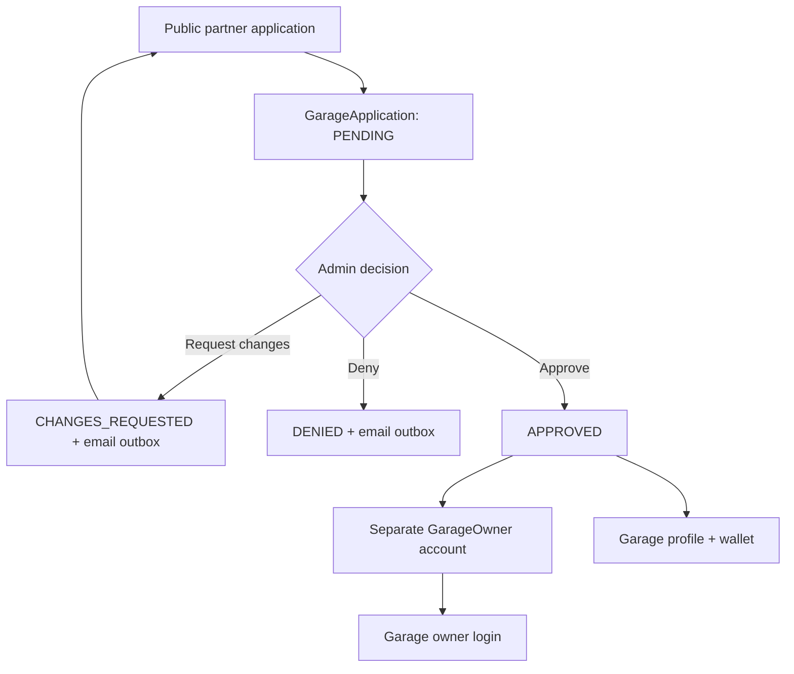
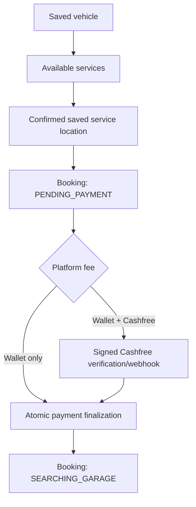
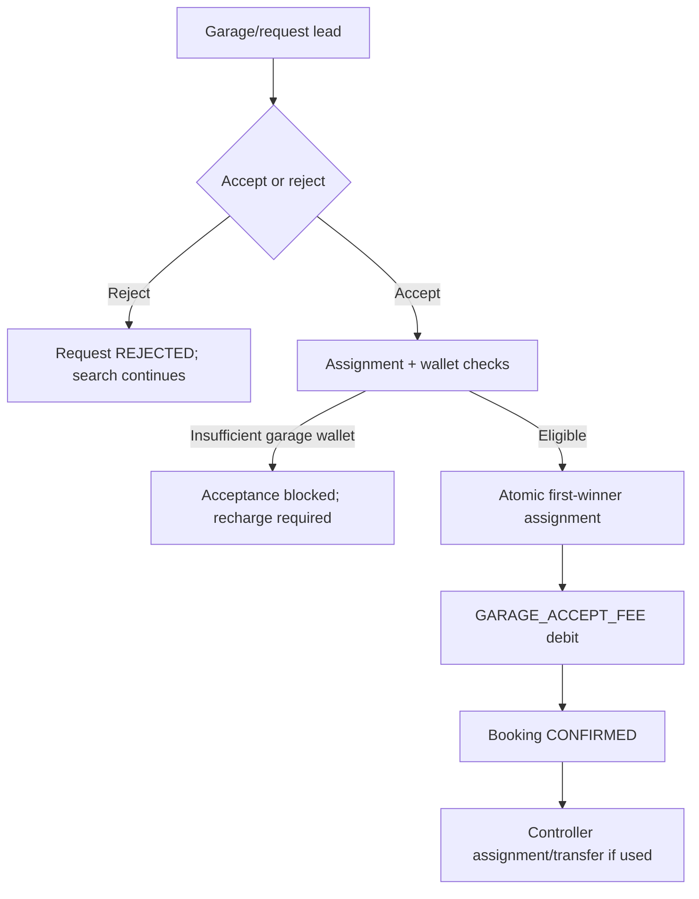
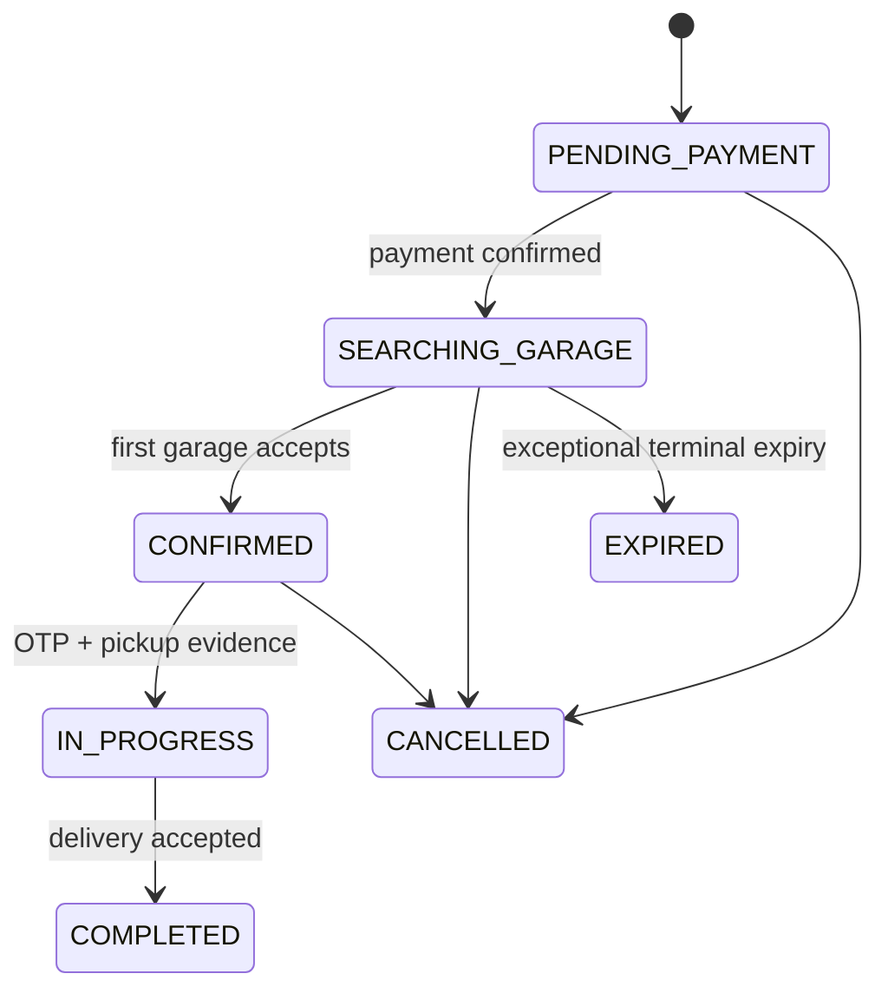

# Garage Partner, Controller, And Booking Flow

> Verified against the implementation on 23 July 2026.

## 1. Partner application and approval

The application accepts garage identity, owner/contact details, address/coordinates, service radius, capabilities, terms acceptance, and optional media/email fields. Approval creates or links the separate `GarageOwner`, creates the `Garage`, and establishes the operational wallet/profile. Application emails are delivered asynchronously through `GarageApplicationEmailOutbox`.

## 2. Garage login and controller accounts

The `/garage/login` screen has two explicit account modes:

1. **Garage owner** — signs in with the approved owner phone/email and password.
2. **Controller / staff** — signs in with the controller phone/email and password.

Both use `POST /api/v1/auth/login` with an explicit requested role, but they receive different account types and database-backed sessions:

- Owner: `role=GARAGE_OWNER`, `accountType=USER`, `GarageOwnerSession`.
- Controller: `role=GARAGE_CONTROLLER`, `accountType=GARAGE_CONTROLLER`, `GarageControllerSession`.

Garage controllers are always scoped to one garage. Owners manage controllers through `/garage/controllers`; administrators manage them through `/admin/garage-controllers`. The admin-set `Garage.controllerLimit` applies per garage. A controller cannot be created after that garage reaches its limit.

Owners/admins can create, edit, activate/deactivate, reset passwords, revoke sessions, inspect activity, soft-delete controllers, and transfer bookings. Controllers can set `AVAILABLE` or `BUSY`.

## 3. Garage configuration and eligibility

A garage is dispatch-eligible only when the current booking and garage satisfy the checks in the booking/garage services. Important signals include:

- Garage operational and verification state.
- Location coordinates and distance radius.
- Requested services and garage service assignments.
- Vehicle/fuel/brand/model capability and exclusion rules.
- Booking not already assigned or terminal.

Customers see a ranked nearby-garage preview, but that preview does not reserve a garage.

## 4. Customer checkout and payment

Service estimates are selected from approved city/service/vehicle price ranges. Missing pricing blocks checkout for that service/vehicle combination. The online amount is the platform fee; it can be paid from the customer wallet, Cashfree, or both. Financial operations use idempotency keys and transactional guards.

## 5. Progressive garage search

The search worker processes paid `SEARCHING_GARAGE` bookings:

| Round | Radius | Default duration |
| --- | ---: | ---: |
| 1 | 5 km | 150 seconds |
| 2 | 10 km | 150 seconds |
| 3 | 20 km | 150 seconds |

After round three, a new cycle starts again at 5 km without another customer payment. A garage is contacted at most once per cycle. Existing requests remain usable while the booking is unassigned.

Eligible garages receive in-app/push/WhatsApp delivery as configured. Available garage controllers can also receive dispatch records. Notification does not guarantee acceptance.

## 6. Acceptance and wallet fee

All eligible nearby garages can receive the lead. A garage with insufficient wallet balance can view the lead but cannot accept until it can cover the acceptance fee. Acceptance is protected against concurrent winners; the successful garage is assigned and competing requests expire.

Customer details are revealed only after assignment, and controller views further limit those details to active assignments.

## 7. Handover, service, and delivery

Before dispatch, the garage must support the booking's pickup/self-drop-off mode, the vehicle brand, and every selected service for the vehicle scope. The same eligibility is checked again when the request is accepted.

1. Assignment generates a six-digit handover OTP with a two-hour expiry.
2. For pickup bookings, the garage collects and returns the vehicle. For self-drop-off bookings, the customer takes the vehicle to the garage and collects it there.
3. The customer shares the OTP only during physical vehicle handover.
4. Garage/controller submits the OTP plus the required handover inspection images.
5. Verification uses hashed OTP storage, bounded attempts, a concurrency claim, and Cloudinary upload.
6. Successful verification changes the booking from `CONFIRMED` to `IN_PROGRESS`.
7. Garage/controller uploads delivery inspection images and marks the vehicle delivered.
8. Customer reviews the delivery, supplies/confirms the final service amount, and accepts delivery.
9. Booking becomes `COMPLETED`; review, service history, and warranty flows become available.

`deliveredAt` is a delivery checkpoint, not a separate `BookingStatus`.

## 8. Booking status model

`GARAGE_ASSIGNED` remains in the enum and read compatibility paths, while the active acceptance implementation writes `CONFIRMED`.

## 9. Cancellation and refunds

Customer cancellation is available before service starts for supported pre-service statuses. Broadcast requests are expired and the booking is marked `CANCELLED`. Eligible paid platform-fee value is credited to the customer wallet using idempotent financial records. Late Cashfree success and wallet-balance races are reconciled to wallet credit instead of double charging or losing funds.

## 10. Operational ownership

| Actor | Authority |
| --- | --- |
| Customer | Own vehicles, locations, booking, payment, delivery acceptance, complaints/tickets, and reviews |
| Garage owner | Own garage profile/services, wallet, requests, controller roster, and garage work |
| Garage controller | Assigned/allowed garage work and availability; no owner-level account administration |
| Customer support | Ticket workflow and customer communications, not arbitrary booking/payment mutation |
| Intern | Read-oriented operations and submission workflows |
| Admin | Platform operations, moderation, garage/controller limits, transfers, protected maintenance |

Backend authorization is authoritative. Frontend route guards are navigation controls only.
