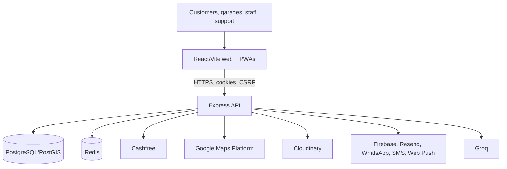
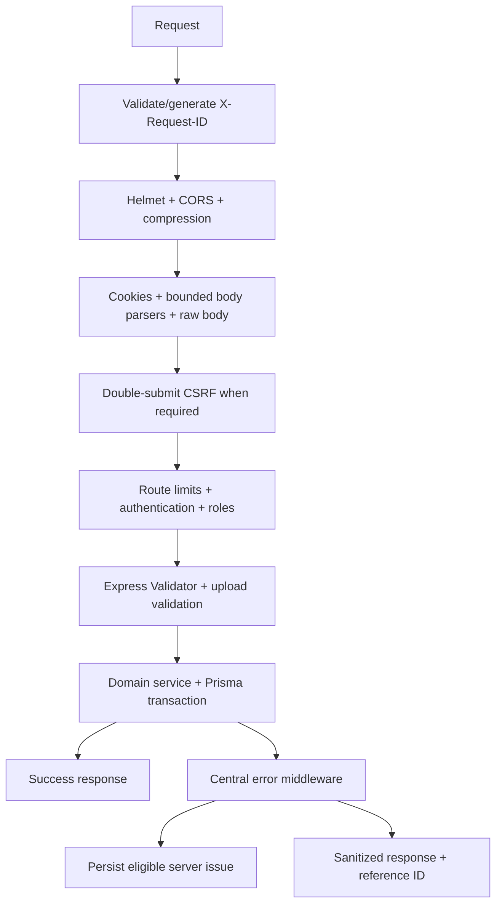
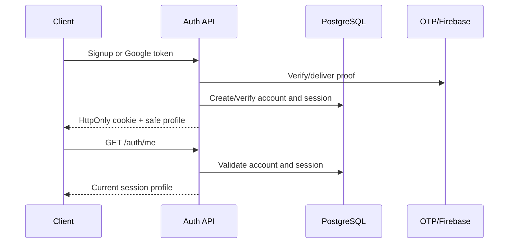
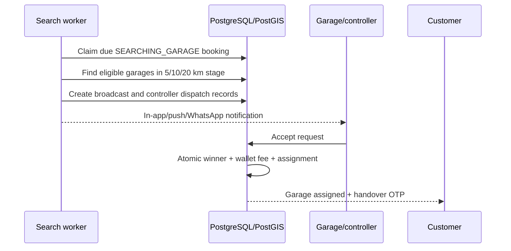

# Rovauto Solution Architecture

> Canonical solution-design and API reference, verified against the source on 23 July 2026.

## 1. Purpose and boundaries

Rovauto is a multi-actor vehicle-service marketplace. It owns:

- Customer identity, vehicles, service locations, bookings, platform-fee payments, wallet, delivery acceptance, reviews, complaints, support, and notifications.
- Garage applications, owners, services/capabilities, controller/staff accounts, booking leads, garage wallet acceptance fees, inspection evidence, and tracking.
- Admin/intern/customer-support operational consoles.
- City/category/service availability and moderated city/service/vehicle price ranges.

Rovauto does not currently settle the final repair bill through Cashfree. The online checkout amount is the Rovauto platform fee; the final service amount is recorded at delivery acceptance and paid to the garage outside the platform flow described by this code.

## 2. System context

### Trust boundaries

1. Browser input is untrusted and must pass validation, authentication, authorization, ownership, and domain checks.
2. Provider callbacks bypass browser CSRF but are untrusted until signature and freshness checks succeed.
3. PostgreSQL is authoritative.
4. Redis is an optimization and distributed-limit store, not a source of truth.
5. External provider success is not authoritative for business state until verified and reconciled into PostgreSQL.

## 3. Deployable units

| Unit | Responsibility | State |
| --- | --- | --- |
| `client/` | Five HTML/PWA shells using one React route tree | Stateless build artifacts |
| Express HTTP process | API, middleware, provider adapters, health | Stateless except in-process fallbacks |
| In-process workers | Garage search, issue auto-resolution, application email outbox, session cleanup | Coordinated through database state; no external queue |
| PostgreSQL/PostGIS | Transactional system of record and geo queries | Durable |
| Redis | Caches, rate-limit counters, distributed coordination helpers | Ephemeral |

The current worker design should be treated as single-active-process unless every worker's claim semantics are proven under multiple replicas.

## 4. Client architecture

`index.html`, `garage.html`, `admin.html`, `intern.html`, and `support.html` all boot `src/main.jsx` and `src/App.jsx`. React Router selects public/customer, garage owner/controller, admin, intern, or support layouts.

Shared client concerns:

- `src/api/axios.js`: base URL, cookies, CSRF, timeouts, safe retries, correlation IDs, and eligible error reporting.
- `src/hooks/useApp.jsx`: session/profile and application orchestration.
- Redux slices: customer and garage state.
- Booking helpers: cart persistence, payment recovery, price validation, status timelines.
- Maps helpers/components: address selection, static/embed/live route rendering.
- PWA helpers: role-specific manifests, service workers, and push subscriptions.

Frontend guards are navigation controls. Server middleware and service ownership rules are the security boundary.

## 5. Server request pipeline

`app.js` also exposes liveness/readiness and mounts `/api/v1`. Unknown routes return a JSON `404`.

## 6. Identity, sessions, and roles

| Actor | Persistent account | Session | Cookie |
| --- | --- | --- | --- |
| Customer | `User` | `UserSession` | `accessToken` |
| Garage owner | `GarageOwner` | `GarageOwnerSession` | `accessToken` |
| Garage controller | `GarageController` | `GarageControllerSession` | `accessToken` |
| Admin/intern | `StaffAccount` | `StaffSession` | `accessToken` |
| Customer support | `CustomerSupportAccount` | `CustomerSupportSession` | `supportAccessToken` |

JWT claims identify account, account type, role, and session. Middleware reloads the current account and session, rejects deleted/disabled/expired/revoked records, and rejects tokens issued before `passwordChangedAt`.

The garage login UI requires the user to choose owner or controller/staff. Controllers are tied to one garage; `Garage.controllerLimit` is enforced per garage inside a transaction.

## 7. Core data flows

### 7.1 Customer registration and login

Staff/admin authentication may return a two-factor challenge before issuing a session.

### 7.2 Booking and payment

1. Customer owns and selects a saved vehicle and saved service location.
2. Services are filtered by active state and city/category/service restrictions.
3. Approved price ranges are resolved for city, service, vehicle brand/model/fuel scope.
4. Checkout creates `Booking(PENDING_PAYMENT)` and immutable booking-service estimate snapshots.
5. Payment service calculates customer-wallet and Cashfree portions.
6. Wallet reservation/debit, provider identifiers, webhook/verification, and booking transition are guarded with transactions/idempotency keys.
7. Successful payment writes `PAID` and moves the booking to `SEARCHING_GARAGE`.

### 7.3 Progressive garage dispatch

Each 5/10/20 km round defaults to 150 seconds. A garage is contacted once per cycle; after 20 km the next cycle restarts at 5 km without another customer charge.

### 7.4 Garage controller dispatch

- Owner/admin creates a controller within the garage-specific limit.
- Controller logs in using `GARAGE_CONTROLLER`.
- Available controllers may receive `GarageControllerDispatch` records.
- Booking assignment is stored in `Booking.garageControllerId`.
- Owner/admin can transfer assignment.
- Controller dashboard exposes own active assignments and privacy-filtered combined terminal history.

### 7.5 Handover and completion

1. Acceptance generates a six-digit OTP; only its hash is stored.
2. Garage owner/controller submits OTP and required pickup images.
3. A concurrency claim prevents simultaneous OTP use; attempt and expiry limits apply.
4. Durable image upload plus successful OTP changes `CONFIRMED` to `IN_PROGRESS`.
5. Garage uploads delivery images and sets `deliveredAt`.
6. Customer accepts delivery and final amount.
7. Booking changes to `COMPLETED`; activity, notification, review, history, and warranty flows follow.

### 7.6 Cancellation and financial reconciliation

Pre-service cancellation expires broadcasts and sets `CANCELLED`. Eligible paid value is credited to the customer wallet exactly once. Late Cashfree success and wallet-balance changes are reconciled with idempotent wallet credits instead of silently discarding provider success.

### 7.7 Support and issues

Customers create tickets/disputes and replies with optional attachments. Customer-support accounts can claim/release/respond and communicate through notification/email surfaces. Admins can supervise ticket status/resolution.

Frontend/API/background failures can create `SystemIssue` records. The auto-resolver probes only allowed targets/statuses and respects quiet periods and actor/probe policies.

## 8. API conventions

- Base path: `/api/v1`.
- Browser authentication: HttpOnly cookies, not bearer tokens.
- Unsafe authenticated browser requests: `rovautoCsrf` cookie plus `X-CSRF-Token`.
- Success shapes commonly use `{ success, statusCode, message, data }`.
- Failure shape: `{ success:false, statusCode, message, code?, referenceId, stack? }`.
- `X-Request-ID` is accepted only in a safe character/length form or regenerated.
- List endpoints use query validation; selected large lists use cursor pagination.
- Money is whole INR rupees as integers.
- IDs are UUID strings unless a human booking/ticket code is explicitly used.

## 9. Complete HTTP API inventory

The paths below are relative to `/api/v1`. “Customer”, “owner”, “controller”, “staff”, and “support” mean authenticated and role/ownership checked as implemented.

### 9.1 Platform and authentication

| Scope | Endpoints |
| --- | --- |
| Public auth | `POST /auth/signup`, `/auth/verify-otp`, `/auth/resend-otp`, `/auth/send-otp`, `/auth/login`, `/auth/staff/verify-otp`, `/auth/staff/resend-otp`, `/auth/google`, `/auth/forgot-password`, `/auth/reset-password` |
| Authenticated auth | `POST /auth/verify-phone-otp`, `/auth/logout`, `/auth/change-password`; `GET /auth/me` |
| Support auth | `POST /auth/support/login`, `/auth/support/logout`; `GET /auth/support/me` |
| Legacy phone OTP aliases | `POST /send-otp`, `/verify-otp` |
| Public/platform | `GET /public/stats`, `POST /system-issues/report`, `GET /csrf-token` |

`GET /csrf-token` is mounted directly as `/api/v1/csrf-token`.

### 9.2 Cities, services, vehicle metadata, contact, maps

| Area | Endpoints |
| --- | --- |
| Cities | `GET /cities`; staff `GET /cities/admin`; admin `POST /cities/admin`, `PATCH /cities/admin/:cityId` |
| Services | `GET /services/categories`, `/services`, `/services/:id`, `/services/:serviceId/media` |
| Service media admin | `POST /services/:serviceId/media`, `PATCH /services/media/:mediaId`, `DELETE /services/media/:mediaId` |
| Vehicle metadata | `GET /vehicle-meta/brands`, `/vehicle-meta/brands/:brandId/models` |
| Contact | `POST /contact` |
| Public maps | `GET /maps/config`, `/maps/places/:placeId`; `POST /maps/autocomplete`, `/maps/validate-address` |
| Authenticated maps | `POST /maps/route`, `/maps/route-matrix`, `/maps/roads/snap`; `GET /maps/bookings/:bookingId/tracking` |
| Garage/admin tracking | `POST /maps/bookings/:bookingId/tracking/start`, `/location`, `/stop` |
| Admin optimization | `POST /maps/optimize-routes` |

### 9.3 Customer profile, locations, vehicles, dashboard

| Area | Endpoints |
| --- | --- |
| Profile | `POST /customer/onboarding`, `/customer/profile/avatar`; `GET /customer/profile`; `PATCH /customer/profile`, `/customer/change-password`; `DELETE /customer/delete-account` |
| Location lookup | Public `GET /locations/reverse-geocode`; customer `GET /locations/geocode` |
| Saved locations | `GET/POST /locations`; `GET/PATCH/DELETE /locations/:id`; `PATCH /locations/:id/default` |
| Vehicles | `GET/POST /vehicles`; `GET/PATCH/DELETE /vehicles/:id`; `PATCH /vehicles/:id/default` |
| Dashboard/activity | `GET /dashboard/customer`, `GET/POST /activities` |
| Notifications | `GET /notifications`, `PATCH /notifications/read-all`, `PATCH /notifications/:id/read` |

### 9.4 Customer booking, payment, wallet, review, support

| Area | Endpoints |
| --- | --- |
| Bookings | `POST /bookings/checkout`; `GET /bookings`, `/bookings/pending-payment`, `/bookings/service-history`, `/bookings/:id`, `/bookings/:id/success`; `POST /bookings/:id/accept-delivery`, `/bookings/:id/handover-otp/regenerate`; `PATCH /bookings/:id/cancel` |
| Payments | `GET /payments`; `POST /payments/create-order`, `/payments/verify`, `/payments/cancel` |
| Cashfree webhook | `POST /webhooks/cashfree` |
| Customer wallet | `GET /wallet`, `/wallet/transactions`; `POST /wallet/recharge` |
| Reviews | `POST /reviews`; `GET /reviews/my`; `PATCH/DELETE /reviews/:id` |
| Complaints | `POST /complaints`; `GET /complaints/my`, `/complaints/:id` |
| Support tickets | `GET /support-tickets/bookings`, `/my`, `/:ticketId`; `POST /support-tickets`, `/:ticketId/replies`; `PATCH /support-tickets/:ticketId/close` |
| Chatbot | `GET /chatbot/history`; `POST /chatbot/ask`; `DELETE /chatbot/history` |
| SOS | `POST /sos`; `GET /sos/:id` |
| Push | `GET /push/public-key`; `POST/DELETE /push/subscriptions` |

### 9.5 Garage application, profile, media, wallet, requests

| Area | Endpoints |
| --- | --- |
| Public application | `GET /garage/applications/geocode`; `POST /garage/applications` |
| Garage profile | Owner/controller `GET /garages/me`, `/garages/me/services`; owner `PUT /garages/me`, `POST /garages/me/delete-otp`, `DELETE /garages/me` |
| Garage media | Public `GET /garages/media/:imageId`; owner/admin `POST /garages/:garageId/media`, `DELETE /garages/:garageId/media/:imageId`; admin `DELETE /garages/:garageId/media` |
| Garage wallet | `GET /garage/wallet`, `/garage/wallet/transactions`; `POST /garage/wallet/recharge/order`, `/recharge/verify` |
| Legacy garage wallet | `GET /garage/wallet-legacy`, `/transactions`; `POST /garage/wallet-legacy/recharge` |
| Booking requests | `GET /garage/requests`, `/:requestId`; `POST /garage/requests/:requestId/accept`, `/reject`, `/verify-handover-otp`, `/mark-delivered` |

### 9.6 Garage controller management

| Actor | Endpoints |
| --- | --- |
| Garage owner | `GET/POST /garage/controllers`; `GET /garage/controllers/:controllerId/activity`; `PATCH /garage/controllers/:controllerId`, `/:controllerId/password`; `POST /garage/controllers/:controllerId/revoke-sessions`, `/garage/controllers/bookings/:bookingId/transfer`; `DELETE /garage/controllers/:controllerId` |
| Controller self | `GET /garage/controller/dashboard`; `PATCH /garage/controller/availability` |

### 9.7 Customer-support portal

All are under `/customer-support` with the support session:

- Push: `GET /push/public-key`, `POST/DELETE /push/subscriptions`.
- Dashboard: `GET /dashboard`.
- Tickets: `GET /tickets`, `/tickets/:ticketId`; `POST /tickets/:ticketId/claim`, `/release`, `/replies`; `PATCH /tickets/:ticketId`.
- Customer notification sending: `POST /notifications/send`.
- Support notifications: `GET /notify`; `PATCH /notify/read-all`, `/notify/:notificationId/read`.
- Notification history: `GET /notifications`; `PATCH /notifications/read-all`, `/notifications/:notificationId/read`.
- Email: `GET /email-users`, `/emails/history`; `POST /emails`.

### 9.8 Admin and intern operations

| Prefix | Endpoints |
| --- | --- |
| `/admin` | `GET /stats`, `/operations`, `/customers`, `/customers/:userId/profile`, `/bookings`, `/bookings/:bookingId`, `/payments`, `/wallet-transfers/recipients`; `PATCH /bookings/:bookingId/status`, `/bookings/:bookingId/garage`; `POST /bookings/:bookingId/notes`, `/wallet-transfers`; `DELETE /customers`, `/bookings/all` |
| `/admin/garage-applications` | `GET /`, `/:applicationId`; `POST /:applicationId/approve`, `/request-changes`, `/deny`; `DELETE /` |
| `/admin/city-service-price-ranges` | `GET /`, `/submissions`, `/:id`; `POST /`, `/submissions/approve-all`; `PATCH /:id`, `/submissions/:id`, `/submissions/:id/review`; `DELETE /`, `/:id`, `/submissions`, `/submissions/:id` |
| `/admin/cars` | Brand `GET/POST /brands`, `GET/PATCH/DELETE /brands/:brandId`; models `POST /brands/:brandId/models`, `PATCH/DELETE /models/:modelId` |
| `/admin/services` | Category `GET/POST /categories`, `PATCH/DELETE /categories/:categoryId`, `POST /categories/:categoryId/thumbnail`; service `POST /`, `PATCH/DELETE /:serviceId`, `POST /:serviceId/thumbnail` |
| `/admin/garages` | `GET /`, `/services`, `/:garageId`; `PATCH /:garageId`, `/:garageId/status`, `/:garageId/images/order`, `/:garageId/images/:imageId/thumbnail`; `POST /:garageId/services`; `DELETE /`, `/:garageId/services/:serviceId` |
| `/admin/garage-controllers` | `GET /`; `POST /garage/:garageId`; `GET /:controllerId/activity`; `PATCH /:controllerId`, `/:controllerId/password`, `/garage/:garageId/limit`; `POST /:controllerId/revoke-sessions`, `/bookings/:bookingId/transfer`; `DELETE /:controllerId` |
| `/admin/support-tickets` | `GET /staff`, `/`, `/:ticketId`; `PATCH /:ticketId`; `POST /:ticketId/replies` |
| `/admin/customer-support-accounts` | `GET/POST /`; `PATCH /:accountId`, `/:accountId/password` |
| `/admin/intern-accounts` | `GET/POST /`; `PATCH /:accountId`, `/:accountId/password` |
| `/admin/system-issues` | `GET /stats`, `/`, `/:issueId`; `PATCH /:issueId/status`; `DELETE /resolved`, `/:issueId` |
| `/admin/dangerous` | `GET /commands`; `POST /commands/:command/download`, `/commands/:command/run` |

Admin route modules distinguish `ADMIN` from `INTERN` per operation; do not infer write access from the shared `/admin` prefix.

### 9.9 Provider webhooks

| Provider | Endpoints |
| --- | --- |
| Cashfree | `POST /webhooks/cashfree` |
| WhatsApp/Meta | `GET/POST /webhooks/whatsapp/webhook`; aliases `GET/POST /whatsapp/webhook`; `GET /whatsapp/health` |

Webhook handlers require raw request bytes for signature verification. They are excluded from CSRF because they are server-to-server callbacks.

## 10. Background processing

| Worker | Trigger/state | Failure behavior |
| --- | --- | --- |
| Garage search | Interval scans due `SEARCHING_GARAGE` bookings | Records/retries through booking state; reports background errors |
| Application email outbox | Pending/retryable outbox rows | Attempts, lock timeout, retry metadata |
| System issue resolver | Enabled interval, quiet/probe rules | Leaves issue unresolved on unsafe/failed probe |
| Session retention | Configured interval/retention | Deletes old expired/revoked session data |

## 11. Caching and consistency

- Cache keys are namespaced by domain/user/query.
- Customer mutations invalidate profile/dashboard/booking patterns.
- City, public stats, services/prices, reviews, and locations use configured TTLs.
- Cache failure must not replace PostgreSQL results with invented state.
- Financial, assignment, OTP, and moderation invariants are enforced in PostgreSQL transactions and conditional updates, not in Redis.

## 12. External integration rules

| Integration | Authoritative check |
| --- | --- |
| Cashfree | Server-side order/payment verification, signature/freshness, amount/order match, idempotent finalization |
| Google Maps | Server-side keys for billable services; browser key restricted; stored booking coordinates remain authoritative destination |
| Cloudinary | Persist returned URL/public ID only after validated upload; cleanup on failed multi-step flows |
| Firebase | Verify Google ID tokens server-side; Firebase Admin credentials never reach browser |
| Resend/SMS/WhatsApp/Push | Notification is best-effort; database booking state remains authoritative |
| Groq | Chatbot receives privacy-filtered context and cannot mutate booking/payment state |

## 13. Scaling evolution

Current architecture is appropriate for an early city launch if one worker-bearing API process is used and database/Redis/provider observability is active.

Scale in this order:

1. Add production metrics, structured logs, traces, and alerts.
2. Move background work to a durable queue with idempotent jobs and dead-letter handling.
3. Separate API and worker deployments.
4. Add read replicas/cache refinement only after measured bottlenecks.
5. Partition high-volume append-only tables such as tracking/activity/notifications if measured growth requires it.
6. Introduce city/region sharding only after a single PostgreSQL/PostGIS cluster is proven insufficient; preserve global identity and financial ledgers.

GraphQL is not required for the current product. REST route ownership is explicit and adequate; adopt another API style only for measured client aggregation/versioning needs.

## 14. Change checklist

Any behavior change must update:

- Route, role, validation, service, and owning tests.
- Prisma schema plus forward migration for persistence changes.
- Cache invalidation and idempotency strategy.
- Provider reconciliation and timeout behavior.
- This architecture file and the appropriate security/database/error document.
- Customer chatbot knowledge when customer-visible behavior changes.
