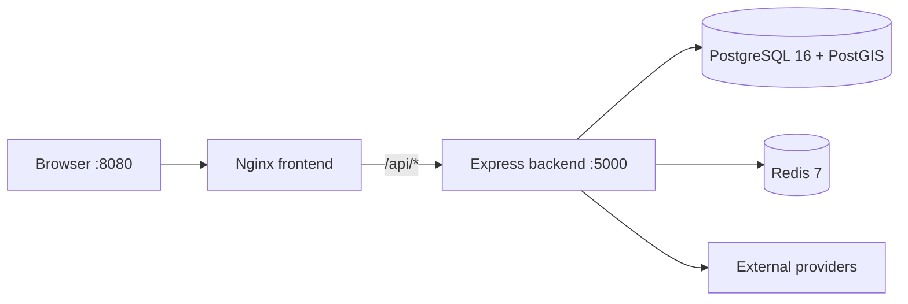
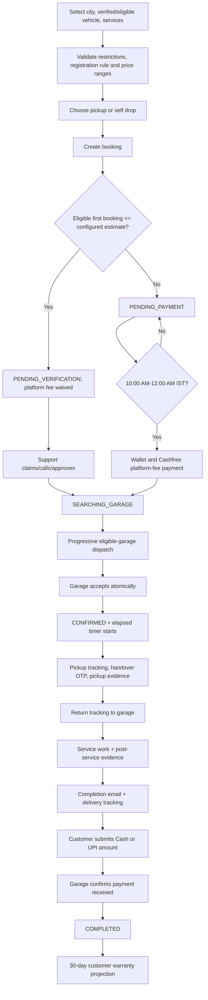

# Rovauto Solution Architecture

> Code-verified architecture snapshot: 8 August 2026.

## 1. Purpose and boundaries

Rovauto is a marketplace and operational workflow for vehicle servicing. It coordinates customers, garages, garage controllers, no-account workers, support staff, interns, and administrators. The platform does not perform the physical repair; it records service selection, payment, assignment, handover, evidence, tracking, completion, warranty projection, and support history.

Primary trust boundaries:

1. Public browser and unauthenticated worker-task browser.
2. Customer browser session.
3. Garage owner/controller browser session.
4. Staff and customer-support sessions.
5. Express API and background jobs.
6. PostgreSQL and Redis.
7. External providers and webhooks.

## 2. Deployable units

| Unit | Responsibility |
| --- | --- |
| `client` | React/Vite web application with five HTML/PWA shells |
| `server` | Express API, domain services, workers, Prisma, integrations |
| `mobile/apps/customer` | Early Expo customer app sharing the backend contract |
| PostgreSQL/PostGIS | Durable domain and geospatial state |
| Redis | Cache, rate limits, and coordination |
| Cloudinary | Images and videos |
| Provider services | Payments, maps, auth, email, WhatsApp, push, AI |
| Docker Compose | Local PostGIS, Redis, backend, and Nginx frontend orchestration |

The current web deployment is path-based. `/admin`, `/intern`, `/garage`, `/support`, and `/dashboard` are not separate subdomains.

Local Compose topology:



Nginx serves all five HTML/PWA shells and keeps API requests same-origin. The backend entrypoint retries `prisma migrate deploy`, verifies the generated client, and starts only after PostGIS and Redis are healthy.

## 3. Client architecture

The React route tree is shared in `client/src/App.jsx`. Five HTML documents provide actor-specific PWA manifests and service workers.

Important routes:

| Route | Access |
| --- | --- |
| `/warranty` | Public mock/design page, intentionally unchanged |
| `/dashboard/warranty` | Authenticated customer real warranty data |
| `/worker-task/:token` | Public token-scoped no-account worker task |
| `/admin/system-health` | Admin/sub-admin System Health |
| `/intern/system-health` | Intern System Health |
| `/garage/controllers` | Owner controller management, hidden when disabled |

The shared Axios client manages cookies, CSRF, request IDs, bounded safe retries, and issue reporting. The worker-task API wrapper is unauthenticated but token-scoped. Service-history PDF generation is a client-side read/export operation, and Cloudinary video URLs are normalised client-side for H.264 MP4 playback while retaining an original-source fallback.

### Frontend state ownership

The web client uses layered state rather than treating browser HTTP cache as application state:

```text
React component / route
  ├─ local state or URL params      -> form/dropdown/page-only state
  ├─ Redux Toolkit                 -> shared client-owned selection/cart/session UI
  └─ TanStack Query                -> backend-owned API data and invalidation
                                      |
                                      v
                                    Axios
                                      |
                                      v
Express API -> Redis -> PostgreSQL
```

Current TanStack Query keys cover customer dashboard, vehicles, active/history bookings, profile, service categories, vehicle catalogue, admin vehicles and admin customer login history. Redux owns the booking cart/cart-context and continues to hold the selected vehicle/location and existing actor state. Some server data is mirrored into Redux for backward compatibility, but TanStack Query is the preferred fetch/cache owner for new server-state work.

TanStack Query cache is per running browser application and survives route navigation but not a full application restart unless explicitly persisted. Redis is shared by backend requests from every user. Neither replaces PostgreSQL as source of truth.

## 4. Server request pipeline

```text
request ID
→ Helmet/CORS/compression/cookies
→ JSON/urlencoded parsing with raw webhook body
→ CSRF policy
→ route-specific authentication/authorization
→ validation/rate limits/upload middleware
→ controller
→ domain service/transaction
→ API response
→ centralized error middleware
```

Public webhook and worker-task routes have dedicated verification/limiting rather than normal browser authentication.

## 5. Identity and roles

### Customer and garage users

- `User` represents customers.
- `GarageOwner` represents central garage accounts.
- `GarageController` represents permanent garage staff accounts.
- Each account family has revocable database sessions.

### Staff

`StaffAccount` roles:

- `ADMIN`: main administrator
- `SUB_ADMIN`: administrator
- `INTERN`: operational intern

All three can access the combined System Health centre. Main-admin-only operations remain separately protected.

### Customer support

Customer support has separate account/session models and a separate browser cookie/shell.

### No-account worker

A `GarageWorkerTask` is not an identity account. It grants temporary capability to one accepted booking, one garage, and one task stage through an expiring token. Only the token hash is stored.

## 6. Customer booking flow



Missing approved pricing blocks checkout. Payment actions are accepted from 10:00 AM inclusive until midnight exclusive in `Asia/Kolkata`; the browser guard improves feedback but the backend check is authoritative. Payment and garage acceptance are idempotent/transactional boundaries.

## 6A. Vehicle registration verification

`User.vehicleRegistrationRequired` is the durable compatibility switch. The migration default is `false`, preserving existing customers; customer accounts created after the feature set it to `true`.

For required accounts:

1. Customer enters a normalized registration number while adding/editing a vehicle.
2. Browser calls Rovauto, never Way2API directly.
3. Server applies the customer RC-verification rate limit (maximum 3 attempts in a rolling 24-hour window).
4. `vehicleRegistration.service` calls Way2API with the server-only Bearer API key and validates the structured result.
5. Maker/model/fuel are compared with the Rovauto vehicle selection; mismatch does not verify the vehicle.
6. Full RC owner name is stored for authorised admin use, while a masked version is available for customer-facing presentation.
7. A new required-account vehicle cannot be saved/used for booking until verified. Legacy accounts may keep an unverified/missing registration and may opt in later.

Vehicle creation has a separate maximum of 3 attempts per rolling 24 hours. Registration verification and registration changes share their own 3-per-24-hour bucket.

Admin Vehicles exposes an explicit live Way2API lookup for authorised staff. It does not use the Rovauto account phone as an RC phone; Way2API's documented RC result does not supply that field.

## 6B. First-booking verification lead

Eligible first bookings are defined by zero previous bookings/unused first-booking offer and a maximum estimated service total controlled by `FIRST_BOOKING_FREE_MAX_ESTIMATE` (default 5000). When eligible, the one-time offer is consumed when the verification lead is created, the platform fee is waived, and the booking enters `PENDING_VERIFICATION` before garage search.

Customer Support sees a shared lead queue. The first agent claims the lead, may start the call timer, records optional notes, then approves or rejects. Approval continues the booking toward garage search; suspicious rejection creates the configured escalation path. Unclaimed leads are escalated by the background lead worker after the configured delay (default 2 minutes).

## 7. Fulfilment and garage eligibility

### Service and booking choice

`Service.fulfillmentType` controls whether a service supports both methods, pickup/delivery only, or self drop only. `Booking.fulfillmentType` snapshots the customer-selected method.

### Garage capability

`Garage.fulfillmentMode` independently controls which booking methods a garage can receive.

A garage is eligible only if:

- It is verified, active, operational, within range, and available.
- Its fulfilment mode supports the booking.
- Its supported brand list contains the booking brand or `ALL`.
- Garage-wide exclusions do not block the brand.
- Every selected service has an active matching `GarageService` scope.
- No service exclusion blocks the brand/model.

Scope examples:

- `BMW / ALL` matches BMW X1.
- `ALL / ALL` matches every vehicle unless excluded.
- `BMW / X3` does not match BMW X1.

The same capability check runs during candidate search, immediately before notification, and in the acceptance transaction.

## 8. Progressive dispatch

The search worker expands through configured radius rounds, currently represented in booking/request state by round, cycle, radius, and expiry. `GarageBroadcastRequest` records the durable offer per garage.

Controller accounts enabled:

1. Available controllers are selected using the existing garage controller dispatch rules.
2. Dispatch records are created per controller/channel.
3. Acceptance and busy/available transitions remain controller-aware.
4. The owner remains the fallback where the controller workflow specifies it.

Controller accounts disabled:

1. Active controller sessions are revoked.
2. Controller login and controller notification delivery are blocked.
3. The central owner receives the accepted-booking operational notification.
4. Owner/admin creates a `HANDOVER` or `DELIVERY` worker task.
5. The worker receives a WhatsApp task link or the manager shares the generated URL manually.

## 9. No-account worker task flow

### Task creation

Manager route:

```text
POST /api/v1/garage/worker-tasks/booking/:bookingId
```

Authorised actors are main admin, sub-admin, or the assigned garage owner. The garage must have `controllerAccountsEnabled=false`.

Task rules:

- `HANDOVER` only after acceptance and before handover verification.
- `DELIVERY` after handover/service start; the same task can upload completion evidence, track return delivery, confirm customer arrival, and confirm the customer's submitted payment.
- TTL is 1-48 hours.
- A new active task of the same type revokes the older one.
- Only SHA-256 of the random token is stored.

### Public worker route

```text
GET  /api/v1/worker-tasks/:token
POST /api/v1/worker-tasks/:token/tracking/start
POST /api/v1/worker-tasks/:token/tracking/location
POST /api/v1/worker-tasks/:token/tracking/stop
POST /api/v1/worker-tasks/:token/handover
POST /api/v1/worker-tasks/:token/handover/complete-journey
POST /api/v1/worker-tasks/:token/delivery
POST /api/v1/worker-tasks/:token/delivery/arrived
POST /api/v1/worker-tasks/:token/payment/confirm
```

The public projection hides customer phone and all financial data. The browser UI supports English/Hindi and built-in speech synthesis.

### Tracking

Pickup bookings:

1. Worker starts tracking toward the customer.
2. Location points are written with `workerTaskId`.
3. Handover OTP and media move the booking to `IN_PROGRESS`.
4. Destination changes to the garage.
5. Worker keeps tracking until reaching the garage and completes the return journey.
6. After service, post-service evidence starts a separate `DELIVERY_TO_CUSTOMER` journey.
7. The customer submits the final Cash/UPI mode and amount only after the worker confirms arrival.
8. Garage/controller/task worker confirmation is the atomic booking-completion boundary.

Tracking points are partitioned by `SELF_DROP_TO_GARAGE`, `PICKUP_TO_CUSTOMER`, `RETURN_TO_GARAGE`, and `DELIVERY_TO_CUSTOMER`, so journeys never mix trails. For self-drop, the authenticated customer shares only the initial route to the garage. Garage/controller/worker views that route and confirms arrival with before-service evidence; there is no handover OTP and no second self-drop route.

### Evidence

Each pickup/delivery phase requires:

- 5-15 images
- maximum 1 MB per image
- exactly one video
- maximum 50 MB video

`BookingInspectionImage` stores both image and video entries through `mediaType` while preserving the historical model name. New Cloudinary videos request an eager H.264 MP4 transformation; the client also derives a compatible delivery URL for older assets and offers retry/direct-open fallback controls. Selected files are not labelled uploaded until the booking media record exists.

## 10. Customer warranties

The protected customer Warranty Center does not use a separate warranty table.

`GET /api/v1/warranties` reads completed bookings with an assigned garage and returns a derived record:

- `W-<bookingCode>` identifier
- selected services
- vehicle
- garage
- activation and expiry dates
- active/expired state
- remaining days

Activation preference:

```text
customerAcceptedAt → deliveredAt → updatedAt
```

Expiry is activation plus 30 days. The frontend recalculates remaining days while open, so no daily decrement job is required. Completed-booking history is separate from the warranty projection: it uses compact summary cards and can generate a detailed black-and-white A4 PDF entirely in the browser from the already-authorised booking payload.

## 11. Vehicle metadata and photos

`VehicleBrand` supports logo assets. `VehicleModel` supports `imageUrl` and `imagePublicId`. Admin Cars owns upload/update/removal. Customer My Vehicles loads vehicle metadata, matches brand/model case-insensitively, and displays the model image with an icon fallback.

## 12. System Health

The staff System Health page combines:

1. **System Issues**: deduplicated frontend/backend failures, status workflow, notes, deletion, and resolved cleanup.
2. **Integration Health**: read-only checks for runtime, PostgreSQL, Redis, Cloudinary, WhatsApp, Cashfree, Resend, Firebase, Web Push, background work, and issue counts.

Backend access is `ADMIN`, `SUB_ADMIN`, and `INTERN`. Provider secrets are never returned. Probe errors are redacted and optional metadata is masked.

## 13. Payment and financial flow

Cashfree creates/reuses provider orders and webhook verification finalises payment. Customer wallet contribution and payment settlement must remain idempotent. Garage acceptance charges are recorded in garage wallet ledgers. Refund/cancellation logic must reconcile provider and wallet state through durable transactions rather than UI assumptions.

## 13A. Admin customer security operations

Admin customer profiles link to a dedicated Login History view backed by `UserSession` rows. The server groups active sessions into currently logged devices using device ID/user-agent identity and returns both active-device summaries and retained individual sessions with `ACTIVE`, `REVOKED`, or `EXPIRED` state.

`ADMIN` and `SUB_ADMIN` can revoke all active sessions for a customer. The action also removes stale customer web-push subscriptions used by the implementation so logged-out browsers do not continue receiving account notifications. `INTERN` can inspect the history but cannot execute the destructive logout-all action. Session-history visibility is bounded by the server's retention cleanup policy.

## 14. Support and issue flow

- Customers create support/dispute tickets and complaints.
- Customer support can claim, release, reply, and communicate through its separate portal.
- Frontend/backend reporters fingerprint recurring system issues.
- Auto-resolution probes are constrained by a security policy and cannot issue arbitrary outbound requests.
- `X-Request-ID` links generic customer-visible errors to detailed server logs.

## 15. Caching and consistency

- PostgreSQL remains authoritative.
- TanStack Query is the per-browser application-memory server-state cache and request-deduplication layer for migrated client resources.
- Redux is not the API cache; it owns shared client interaction/selection state, with limited compatibility mirrors where the existing app still expects them.
- Redis is the shared backend cache/rate-limit/coordination layer and cache invalidation follows domain mutations for cities, services, garages, pricing, and related public views.
- Critical acceptance, OTP, payment, and moderation decisions are revalidated transactionally.
- Integration Health uses a short server cache unless `force=true` is authorised.
- Worker-task status is synchronised against token expiry and booking state when read.

## 16. External integrations

| Integration | Use |
| --- | --- |
| Cashfree | Payment orders, verification, webhooks, refunds |
| Cloudinary | Garage/service/profile/inspection/model media |
| Google Maps | Geocoding, route data, maps, tracking support |
| Firebase | Google authentication and admin checks |
| Resend | Email OTP and transactional mail |
| WhatsApp Cloud API | Garage/controller/customer notifications and worker-task templates |
| Web Push | Browser notifications |
| Groq | RAG answer generation over approved Markdown knowledge |
| Way2API | Vehicle RC registration verification and authorised live admin RC lookup |

Each provider has timeout, error translation, and secret-redaction requirements. Health probes are read-only.

## 17. Background processing

Current in-process responsibilities include:

- Progressive garage search
- Garage application email outbox
- Session-retention cleanup
- System-issue auto-resolution
- Scheduled price/availability operational work
- First-booking verification-lead escalation worker

Before horizontal scaling, every worker needs distributed claiming or leader election and durable retry/dead-letter behaviour where loss is unacceptable.

## 18. Container deployment contract

- `docker-compose.yml` uses `postgis/postgis:16-3.5-alpine`, not plain PostgreSQL, because the migration history creates the `postgis` extension and a geography GiST index.
- PostgreSQL and Redis use named volumes; normal `docker compose down` preserves them, while `docker compose down -v` is destructive.
- The backend image runs as the non-root `node` user behind `dumb-init` and has a readiness health check.
- The frontend image is an immutable Vite build served by Nginx. Runtime changes to `VITE_*` do not affect an existing image; rebuild when public build configuration changes.
- `server/.env` is loaded at runtime but excluded from image layers. Client secrets do not exist: every `VITE_*` value is browser-visible.

## 19. Scaling evolution

Near-term:

- Keep PostgreSQL/Redis managed and central.
- Put the frontend behind a CDN/WAF.
- Run the API behind Nginx/load balancer with health checks.
- Add structured monitoring and backup drills.

Later:

- Move durable background work to a queue.
- Add object-level audit coverage for worker-task actions.
- Build a lightweight native worker app for reliable background location and offline media upload.
- Add analytics/warehouse pipelines without querying the transactional database for heavy reporting.

Kubernetes is not a prerequisite for launch. Operational maturity, rollback, observability, and backups matter first.

## 20. Change checklist

For every domain change:

1. Identify actor, route, and trust boundary.
2. Update validation, ownership, and state-transition checks.
3. Add/modify Prisma migration when persistence changes.
4. Preserve idempotency and concurrency invariants.
5. Update cache invalidation and background workers.
6. Add source/regression tests.
7. Build the client and validate Prisma.
8. Update the owning Markdown documents and chatbot knowledge.
