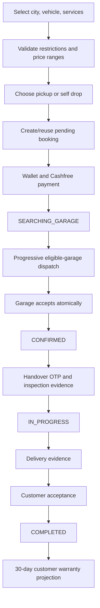

# Rovauto Solution Architecture

> Code-verified architecture snapshot: 28 July 2026.

## 1. Purpose and boundaries

Rovauto is a marketplace and operational workflow for vehicle servicing. It coordinates customers, garages, garage controllers, no-account workers, support staff, interns, and administrators. The platform does not perform the physical repair; it records service selection, payment, assignment, handover, evidence, tracking, completion, warranty projection, and support history.

Primary trust boundaries:

1. Public browser and unauthenticated worker-task browser.
2. Customer browser session.
3. Garage owner/controller browser session.
4. Staff and customer-support sessions.
5. Express API and background jobs.
6. PostgreSQL and Redis.
7. External providers and webhooks.

## 2. Deployable units

| Unit | Responsibility |
| --- | --- |
| `client` | React/Vite web application with five HTML/PWA shells |
| `server` | Express API, domain services, workers, Prisma, integrations |
| `mobile/apps/customer` | Early Expo customer app sharing the backend contract |
| PostgreSQL/PostGIS | Durable domain and geospatial state |
| Redis | Cache, rate limits, and coordination |
| Cloudinary | Images and videos |
| Provider services | Payments, maps, auth, email, WhatsApp, push, AI |

The current web deployment is path-based. `/admin`, `/intern`, `/garage`, `/support`, and `/dashboard` are not separate subdomains.

## 3. Client architecture

The React route tree is shared in `client/src/App.jsx`. Five HTML documents provide actor-specific PWA manifests and service workers.

Important routes:

| Route | Access |
| --- | --- |
| `/warranty` | Public mock/design page, intentionally unchanged |
| `/dashboard/warranty` | Authenticated customer real warranty data |
| `/worker-task/:token` | Public token-scoped no-account worker task |
| `/admin/system-health` | Admin/sub-admin System Health |
| `/intern/system-health` | Intern System Health |
| `/garage/controllers` | Owner controller management, hidden when disabled |

The shared Axios client manages cookies, CSRF, request IDs, bounded safe retries, and issue reporting. The worker-task API wrapper is unauthenticated but token-scoped.

## 4. Server request pipeline

```text
request ID
→ Helmet/CORS/compression/cookies
→ JSON/urlencoded parsing with raw webhook body
→ CSRF policy
→ route-specific authentication/authorization
→ validation/rate limits/upload middleware
→ controller
→ domain service/transaction
→ API response
→ centralized error middleware
```

Public webhook and worker-task routes have dedicated verification/limiting rather than normal browser authentication.

## 5. Identity and roles

### Customer and garage users

- `User` represents customers.
- `GarageOwner` represents central garage accounts.
- `GarageController` represents permanent garage staff accounts.
- Each account family has revocable database sessions.

### Staff

`StaffAccount` roles:

- `ADMIN`: main administrator
- `SUB_ADMIN`: administrator
- `INTERN`: operational intern

All three can access the combined System Health centre. Main-admin-only operations remain separately protected.

### Customer support

Customer support has separate account/session models and a separate browser cookie/shell.

### No-account worker

A `GarageWorkerTask` is not an identity account. It grants temporary capability to one accepted booking, one garage, and one task stage through an expiring token. Only the token hash is stored.

## 6. Customer booking flow



Missing approved pricing blocks checkout. Payment and garage acceptance are idempotent/transactional boundaries.

## 7. Fulfilment and garage eligibility

### Service and booking choice

`Service.fulfillmentType` controls whether a service supports both methods, pickup/delivery only, or self drop only. `Booking.fulfillmentType` snapshots the customer-selected method.

### Garage capability

`Garage.fulfillmentMode` independently controls which booking methods a garage can receive.

A garage is eligible only if:

- It is verified, active, operational, within range, and available.
- Its fulfilment mode supports the booking.
- Its supported brand list contains the booking brand or `ALL`.
- Garage-wide exclusions do not block the brand.
- Every selected service has an active matching `GarageService` scope.
- No service exclusion blocks the brand/model.

Scope examples:

- `BMW / ALL` matches BMW X1.
- `ALL / ALL` matches every vehicle unless excluded.
- `BMW / X3` does not match BMW X1.

The same capability check runs during candidate search, immediately before notification, and in the acceptance transaction.

## 8. Progressive dispatch

The search worker expands through configured radius rounds, currently represented in booking/request state by round, cycle, radius, and expiry. `GarageBroadcastRequest` records the durable offer per garage.

Controller accounts enabled:

1. Available controllers are selected using the existing garage controller dispatch rules.
2. Dispatch records are created per controller/channel.
3. Acceptance and busy/available transitions remain controller-aware.
4. The owner remains the fallback where the controller workflow specifies it.

Controller accounts disabled:

1. Active controller sessions are revoked.
2. Controller login and controller notification delivery are blocked.
3. The central owner receives the accepted-booking operational notification.
4. Owner/admin creates a `HANDOVER` or `DELIVERY` worker task.
5. The worker receives a WhatsApp task link or the manager shares the generated URL manually.

## 9. No-account worker task flow

### Task creation

Manager route:

```text
POST /api/v1/garage/worker-tasks/booking/:bookingId
```

Authorised actors are main admin, sub-admin, or the assigned garage owner. The garage must have `controllerAccountsEnabled=false`.

Task rules:

- `HANDOVER` only after acceptance and before handover verification.
- `DELIVERY` only after handover/service start and before delivery is marked.
- TTL is 1-48 hours.
- A new active task of the same type revokes the older one.
- Only SHA-256 of the random token is stored.

### Public worker route

```text
GET  /api/v1/worker-tasks/:token
POST /api/v1/worker-tasks/:token/tracking/start
POST /api/v1/worker-tasks/:token/tracking/location
POST /api/v1/worker-tasks/:token/tracking/stop
POST /api/v1/worker-tasks/:token/handover
POST /api/v1/worker-tasks/:token/handover/complete-journey
POST /api/v1/worker-tasks/:token/delivery
```

The public projection hides customer phone and all financial data. The browser UI supports English/Hindi and built-in speech synthesis.

### Tracking

Pickup bookings:

1. Worker starts tracking toward the customer.
2. Location points are written with `workerTaskId`.
3. Handover OTP and media move the booking to `IN_PROGRESS`.
4. Destination changes to the garage.
5. Worker keeps tracking until reaching the garage and completes the return journey.

Self-drop bookings do not permit pickup tracking. The task is used for garage handover or ready-for-self-pickup evidence.

### Evidence

Each pickup/delivery phase requires:

- 5-15 images
- maximum 1 MB per image
- exactly one video
- maximum 50 MB video

`BookingInspectionImage` stores both image and video entries through `mediaType` while preserving the historical model name.

## 10. Customer warranties

The protected customer Warranty Center does not use a separate warranty table.

`GET /api/v1/warranties` reads completed bookings with an assigned garage and returns a derived record:

- `W-<bookingCode>` identifier
- selected services
- vehicle
- garage
- activation and expiry dates
- active/expired state
- remaining days

Activation preference:

```text
customerAcceptedAt → deliveredAt → updatedAt
```

Expiry is activation plus 30 days. The frontend recalculates remaining days while open, so no daily decrement job is required.

## 11. Vehicle metadata and photos

`VehicleBrand` supports logo assets. `VehicleModel` supports `imageUrl` and `imagePublicId`. Admin Cars owns upload/update/removal. Customer My Vehicles loads vehicle metadata, matches brand/model case-insensitively, and displays the model image with an icon fallback.

## 12. System Health

The staff System Health page combines:

1. **System Issues**: deduplicated frontend/backend failures, status workflow, notes, deletion, and resolved cleanup.
2. **Integration Health**: read-only checks for runtime, PostgreSQL, Redis, Cloudinary, WhatsApp, Cashfree, Resend, Firebase, Web Push, background work, and issue counts.

Backend access is `ADMIN`, `SUB_ADMIN`, and `INTERN`. Provider secrets are never returned. Probe errors are redacted and optional metadata is masked.

## 13. Payment and financial flow

Cashfree creates/reuses provider orders and webhook verification finalises payment. Customer wallet contribution and payment settlement must remain idempotent. Garage acceptance charges are recorded in garage wallet ledgers. Refund/cancellation logic must reconcile provider and wallet state through durable transactions rather than UI assumptions.

## 14. Support and issue flow

- Customers create support/dispute tickets and complaints.
- Customer support can claim, release, reply, and communicate through its separate portal.
- Frontend/backend reporters fingerprint recurring system issues.
- Auto-resolution probes are constrained by a security policy and cannot issue arbitrary outbound requests.
- `X-Request-ID` links generic customer-visible errors to detailed server logs.

## 15. Caching and consistency

- PostgreSQL remains authoritative.
- Redis cache invalidation follows domain mutations for cities, services, garages, pricing, and related public views.
- Critical acceptance, OTP, payment, and moderation decisions are revalidated transactionally.
- Integration Health uses a short server cache unless `force=true` is authorised.
- Worker-task status is synchronised against token expiry and booking state when read.

## 16. External integrations

| Integration | Use |
| --- | --- |
| Cashfree | Payment orders, verification, webhooks, refunds |
| Cloudinary | Garage/service/profile/inspection/model media |
| Google Maps | Geocoding, route data, maps, tracking support |
| Firebase | Google authentication and admin checks |
| Resend | Email OTP and transactional mail |
| WhatsApp Cloud API | Garage/controller/customer notifications and worker-task templates |
| Web Push | Browser notifications |
| Groq | RAG answer generation over approved Markdown knowledge |

Each provider has timeout, error translation, and secret-redaction requirements. Health probes are read-only.

## 17. Background processing

Current in-process responsibilities include:

- Progressive garage search
- Garage application email outbox
- Session-retention cleanup
- System-issue auto-resolution
- Scheduled price/availability operational work

Before horizontal scaling, every worker needs distributed claiming or leader election and durable retry/dead-letter behaviour where loss is unacceptable.

## 18. Scaling evolution

Near-term:

- Keep PostgreSQL/Redis managed and central.
- Put the frontend behind a CDN/WAF.
- Run the API behind Nginx/load balancer with health checks.
- Add structured monitoring and backup drills.

Later:

- Move durable background work to a queue.
- Add object-level audit coverage for worker-task actions.
- Build a lightweight native worker app for reliable background location and offline media upload.
- Add analytics/warehouse pipelines without querying the transactional database for heavy reporting.

Kubernetes is not a prerequisite for launch. Operational maturity, rollback, observability, and backups matter first.

## 19. Change checklist

For every domain change:

1. Identify actor, route, and trust boundary.
2. Update validation, ownership, and state-transition checks.
3. Add/modify Prisma migration when persistence changes.
4. Preserve idempotency and concurrency invariants.
5. Update cache invalidation and background workers.
6. Add source/regression tests.
7. Build the client and validate Prisma.
8. Update the owning Markdown documents and chatbot knowledge.
