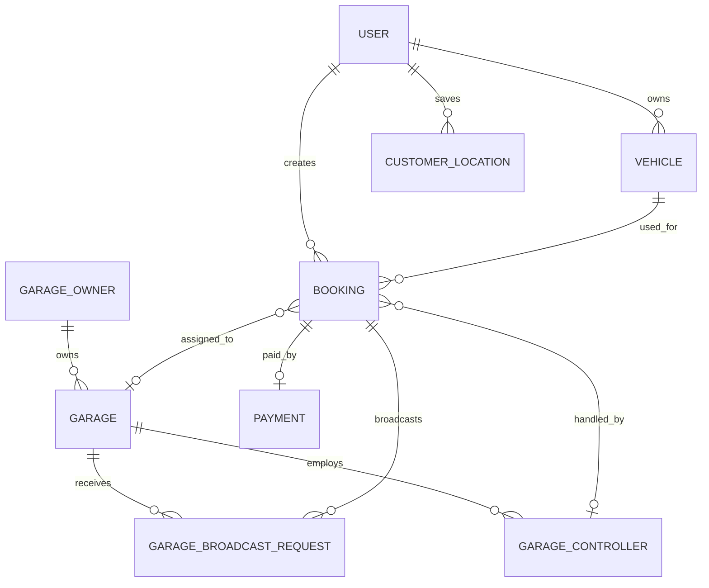
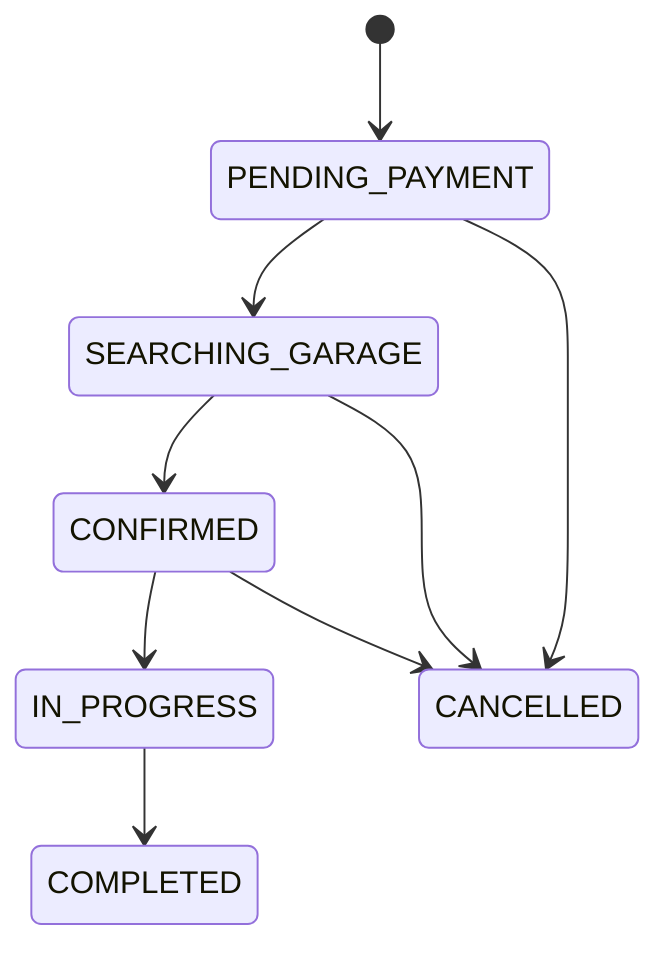

# Rovauto Database Design

> Canonical persistence reference, verified against `server/prisma/schema.prisma` and migrations on 23 July 2026.

## 1. Platform and conventions

- Database: PostgreSQL.
- ORM: Prisma 7 with `@prisma/adapter-pg`.
- Geospatial capability: PostGIS with a partial GiST expression index over active garage longitude/latitude.
- Primary keys: UUID strings generated by Prisma unless stated otherwise.
- Timestamps: `DateTime`; most mutable models use `createdAt` and `updatedAt`.
- Money: whole Indian rupees stored as `Int`. Do not introduce floats for money.
- Soft deletion: used selectively, notably `GarageController.deletedAt`; most dependent records use foreign-key cascade or set-null policies.
- Schema delivery: append-only forward migrations under `server/prisma/migrations`.

## 2. Domain map



## 3. Model inventory

### 3.1 Identity and session models

| Model | Purpose and key constraints |
| --- | --- |
| `User` | Customer account; unique Firebase UID and role-scoped email/phone uniqueness; owns customer data |
| `GarageOwner` | Separate garage-owner identity; unique email/phone; owns garages |
| `GarageController` | Garage-scoped controller/staff; globally unique email/phone; availability, soft deletion, creator audit |
| `StaffAccount` | Admin/intern identity with unique login ID and optional unique email/phone |
| `CustomerSupportAccount` | Dedicated support-agent identity |
| `UserSession` | Revocable customer browser session with device and retention indexes |
| `GarageOwnerSession` | Revocable owner session |
| `GarageControllerSession` | Revocable controller session |
| `StaffSession` | Revocable admin/intern session |
| `CustomerSupportSession` | Revocable support session |
| `StaffLoginChallenge` | Time-bounded staff/support two-factor challenge |
| `StaffPasswordResetChallenge` | Staff password-reset proof and attempt tracking |

Session validation checks expiry, revocation, account state, and password-change time. Session rows are indexed by actor, device, `lastSeenAt`, `expiresAt`, and `revokedAt` as applicable.

### 3.2 OTP and signup models

| Model | Purpose |
| --- | --- |
| `Otp` | Customer account OTP by purpose |
| `PendingSignup` | Unverified signup state |
| `EmailOtp` | Hashed email OTP state |
| `PhoneOtp` | Hashed phone OTP state |
| `GarageOwnerOtp` | Garage-owner OTP by purpose |
| `GarageControllerOtp` | Controller password-reset OTP |

OTP records store hashes, expiry, used markers, and attempt counters. Never add plaintext OTP persistence.

### 3.3 Customer and conversational models

| Model | Purpose |
| --- | --- |
| `CustomerProfile` | One-to-one avatar/address extension for `User` |
| `Vehicle` | Customer vehicle, default marker, fuel type, optional registration |
| `CustomerLocation` | Saved coordinates/address/place metadata and source |
| `CustomerActivity` | Idempotent customer activity timeline using event keys |
| `ChatbotConversation` | Customer conversation container |
| `ChatbotMessage` | Role-tagged messages inside a conversation |

A vehicle may have only one nonterminal active booking through the database guard introduced by migration. Default vehicle/location uniqueness is coordinated by service transactions rather than a partial unique constraint in the Prisma schema.

### 3.4 Garage and capability models

| Model | Purpose and key constraints |
| --- | --- |
| `Garage` | Operational garage, owner, coordinates, city/area, radius, status, ratings, controller limit, capability JSON |
| `GarageImage` | Ordered garage images with thumbnail marker |
| `GarageVideo` | Ordered garage videos and media metadata |
| `GarageService` | Garage/service/vehicle-scope assignment or exclusion; unique composite scope |
| `GarageApplication` | Public partner application and decision state |
| `GarageApplicationImage` | Application evidence/media |
| `GarageApplicationEmailOutbox` | Durable approval/change/denial email delivery state |

`Garage.controllerLimit` defaults to 3 and is checked transactionally per garage. `excludedServiceBrands` and garage/service exclusions are used by capability matching; JSON changes need strict normalization and tests because the database cannot fully constrain their shape.

### 3.5 Catalogue, city, and pricing models

| Model | Purpose |
| --- | --- |
| `ServiceCategory` | Active/coming-soon category and thumbnail |
| `Service` | Category-owned service, active/coming-soon, duration |
| `ServiceMedia` | Ordered image/video media and thumbnail |
| `City` | Normalized supported-city registry and active flag |
| `ServiceCityRestriction` | Unique blocked service/city pair |
| `CategoryCityRestriction` | Unique blocked category/city pair |
| `CityServicePriceRange` | Approved live price range by normalized scope |
| `PriceRangeSubmission` | Pending/edited/reviewed moderation history |
| `VehicleBrand` | Active brand and optional logo asset |
| `VehicleModel` | Unique brand/model pair with optional 2 MB Cloudinary image asset |

`CityServicePriceRange.scopeKey` is the canonical unique identity for normalized city, service, vehicle brand/model, and fuel type. A database check requires `minPrice >= 0` and `maxPrice >= minPrice`. Live checkout reads only the approved range table; submissions do not become live until moderation succeeds.

### 3.6 Booking and dispatch models

| Model | Purpose |
| --- | --- |
| `Booking` | Aggregate root for customer, vehicle, garage/controller assignment, status, location snapshot, fees, search, OTP, delivery, route and final amount |
| `BookingService` | Service snapshot with quantity and estimated/final price fields |
| `GarageBroadcastRequest` | One garage's dispatch request, response, search cycle/round/radius |
| `GarageControllerDispatch` | Per-controller/channel dispatch audit |
| `BookingInspectionImage` | Ordered pickup/delivery evidence |
| `BookingTrackingPoint` | Append-only location samples with actor source and optional snapped road data |
| `AdminBookingEvent` | Staff booking mutation audit |

Important constraints:

- `Booking.bookingCode` is unique.
- `GarageBroadcastRequest` is unique per booking/garage; cycle metadata prevents repeat notification within a cycle.
- `GarageControllerDispatch` is unique per request/controller/channel.
- `BookingInspectionImage` is unique per booking/phase/order.
- `BookingService` is unique per booking/service.
- Controller deletion sets booking/tracking assignment null, while controller-owned notification/dispatch rows cascade as defined.

### 3.7 Financial models

| Model | Purpose and constraints |
| --- | --- |
| `Payment` | One-to-one booking payment, unique Cashfree order/payment IDs, wallet/UPI split |
| `Wallet` | One customer wallet |
| `WalletTransaction` | Customer ledger entry with unique idempotency key |
| `GarageWallet` | One garage wallet |
| `GarageWalletTransaction` | Garage ledger entry with unique idempotency key |

Balances are denormalized current-state values; transaction rows are the audit ledger. Every debit/credit that changes balance must occur in the same database transaction as its ledger entry and business state transition.

### 3.8 Support, reviews, complaints, and notifications

| Model | Purpose |
| --- | --- |
| `Review` | One review per booking, linked to customer and garage |
| `SupportTicket` | Support/dispute aggregate with assignment and resolution |
| `SupportTicketMessage` | Customer/staff/support authored reply and internal marker |
| `SupportTicketAttachment` | Ticket/message media |
| `Notify` | Internal support-account notifications |
| `CustomerSupportPushSubscription` | Support-agent browser push endpoint |
| `CustomerSupportEmailLog` | Outbound support email audit |
| `Complaint` | Customer booking complaint and status |
| `ComplaintImage` | Complaint evidence |
| `Notification` | Customer/owner/controller notification with explicit ownership fields |
| `PushSubscription` | Customer web-push endpoint |
| `GaragePushSubscription` | Garage-owner web-push endpoint |

Notification ownership is explicit. Queries must filter by the current actor and must not infer ownership from notification type or metadata.

### 3.9 Operational model

| Model | Purpose |
| --- | --- |
| `SystemIssue` | Frontend/backend issue, severity, actor attribution, request/reference data, resolution lifecycle |

Sensitive request data must be sanitized before persistence. Probe/auto-resolution policies must not turn an arbitrary stored URL into server-side request forgery.

## 4. Enumerations and state machines

### Booking

`PENDING_PAYMENT`, `SEARCHING_GARAGE`, `GARAGE_ASSIGNED`, `CONFIRMED`, `IN_PROGRESS`, `COMPLETED`, `CANCELLED`, `EXPIRED`.

Current acceptance writes `CONFIRMED`; `GARAGE_ASSIGNED` remains for compatibility.



### Payment and ledgers

- Payment: `CREATED`, `PENDING`, `PAID`, `FAILED`, `REFUNDED`.
- Wallet transaction status: `PENDING`, `SUCCESS`, `FAILED`.
- Wallet transaction type includes recharge, debit/credit, booking payment/refund, garage acceptance fee, cashback, promotion, SOS deduction, and admin transfer-related semantics used by services.

### Dispatch

- Broadcast: `SENT`, `ACCEPTED`, `REJECTED`, `EXPIRED`.
- Controller availability: `AVAILABLE`, `BUSY`.
- Request type: normal or SOS.

### Moderation and support

- Price submission: `PENDING`, `EDITED`, `APPROVED`, `REJECTED`.
- Application: `PENDING`, `CHANGES_REQUESTED`, `APPROVED`, `DENIED`.
- Support and complaint enums encode open/in-review/waiting/resolved/closed-style workflows.

Service methods, not clients, own allowed transitions.

## 5. Geospatial design

Garage coordinates remain scalar `latitude`/`longitude` fields for Prisma compatibility. Migration `20260708210000_add_garage_geo_index`:

1. Enables PostGIS.
2. Creates `Garage_location_geography_gix` using:
   `ST_SetSRID(ST_MakePoint(longitude, latitude), 4326)::geography`.
3. Limits the GiST index to active garages.
4. Adds a city/active/verified B-tree index.

Queries use `ST_DWithin`/`ST_Distance` for radius filtering and ranking, with an application fallback where implemented. Longitude must be passed before latitude to `ST_MakePoint`.

## 6. Critical transactional invariants

### Payment finalization

- One payment per booking.
- Provider order/payment identifiers remain unique.
- Amount, currency, booking, and provider state must match.
- Customer wallet debit and payment split are reserved/finalized once.
- Booking moves to search only after successful finalization.
- Late success/cancellation races reconcile to an idempotent wallet credit.

### Garage acceptance

- Booking must still be searching/unassigned.
- Request must belong to the accepting garage.
- Garage wallet must cover the acceptance fee.
- Conditional update/transaction selects one winner.
- Garage wallet debit and ledger entry occur once.
- Competing requests expire.
- Optional controller assignment belongs to the same garage.

### OTP handover

- Booking must be `CONFIRMED`.
- OTP must be unexpired, unused, and below attempt limit.
- A short-lived claim prevents parallel verification.
- Required images must upload successfully before final transition.
- Success clears/consumes OTP state and writes `IN_PROGRESS`.

### Price moderation

- Draft submissions never act as live prices.
- Approving writes one normalized `scopeKey`.
- Range check and unique scope prevent invalid/duplicate live prices.
- Reviewer, time, reason, and approved-row link preserve audit history.

## 7. Deletion and retention

| Data | Policy |
| --- | --- |
| Customer/garage ownership children | Mostly foreign-key cascade; destructive account scripts need backup and reconciliation |
| Controller | Soft-delete controller; revoke sessions; selected assignments set null |
| Media | Delete Cloudinary object and database row as a coordinated operation; record cleanup failure |
| Sessions | Expired/revoked rows removed by retention worker after configured retention |
| Financial ledgers | Preserve for audit; never casually cascade/delete in product UI |
| Support/system issues | Admin cleanup exists but should follow retention/audit policy |
| Tracking/activity/notifications | High-growth tables; define retention before scale |

## 8. Migration workflow

Development:

```bash
cd server
npm run prisma:format
npm run prisma:validate
npm run prisma:migrate
npm run prisma:generate
npm run prisma:check-client
npm test
```

Release:

```bash
npm ci
npm run prisma:deploy
npm run prisma:generate
npm run prisma:check-client
```

Rules:

1. Never edit a migration already applied to a shared/production database.
2. Prefer expand/backfill/switch/contract for incompatible changes.
3. Make application rollback compatible with the expanded schema.
4. Back up and run the recovery drill before destructive migrations.
5. Verify constraints/indexes with actual PostgreSQL, not only Prisma validation.
6. Keep provider IDs, idempotency keys, and ledger history intact during data migrations.

## 9. Index and query review

Before adding an index, capture the real query and `EXPLAIN (ANALYZE, BUFFERS)` in staging-like data. Prioritize:

- Active booking scans by status/search expiry.
- Garage geo/city/verification/capability filters.
- User/garage/controller session lookup and cleanup.
- Ticket assignment/status/last-message queues.
- Notification ownership/unread order.
- Tracking points by booking and recorded time.
- Price scope and moderation queues.
- Financial provider/idempotency lookups.

Avoid indexing low-selectivity columns alone when a composite index matches the actual predicate/order.

## 10. Backup and recovery

Use `npm run db:backup` for custom-format PostgreSQL dumps and `npm run db:recovery-drill` against an isolated target. The complete procedure and reconciliation list are in [`../server/docs/RECOVERY_RUNBOOK.md`](../server/docs/RECOVERY_RUNBOOK.md).

## 11. Future database evolution

- Keep one PostgreSQL/PostGIS primary until metrics show a bottleneck.
- Add connection pooling and query observability before sharding.
- Consider partitioning tracking, activity, notification, and audit/event tables by time only after volume justifies it.
- Use read replicas for read-heavy reporting, never for read-after-write financial/assignment decisions.
- If city sharding becomes necessary, keep global identity, provider-idempotency, and financial ledgers in an explicitly designed global/control plane.
