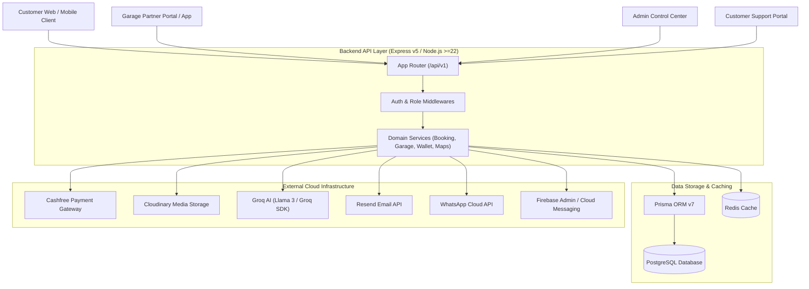

# 00. Project Overview

## 1. Purpose & Business Domain

**Rovauto** is a multi-role, end-to-end vehicle service, maintenance, and garage management backend system. It connects vehicle owners (Customers) with independent repair garages, automated garage controllers, customer support agents, and platform staff admins.

The backend acts as an intelligent marketplace and operations engine that manages:
1. **Garage Onboarding & Application Lifecycle**: Verification of garage credentials, location mapping, working radius, and admin approvals.
2. **Service Discovery & Geo-Location Matching**: Spatial search for active garages within dynamic working radiuses (using Haversine and bounding-box queries).
3. **Automated Booking & Dispatch Cycle**: Real-time garage broadcasting, algorithmically orchestrated search cycles, slot allocation, pickup/drop-off logistics, and worker task tracking.
4. **Financial Transactions & Escrow-style Wallets**: Integration with Cashfree PG, dual wallet systems (Customer Wallet & Garage Wallet), platform fees, auto-settlements, and invoice auditing.
5. **Self Drop-Off & Worker Task Execution**: Tokenized workflows for garage workers to execute pickup, inspection, work completion, and customer drop-off with live geo-tracking.
6. **Support & AI Assistance**: Embedded AI chatbot powered by Groq LLM, ticket escalation, customer complaints, dispute resolution, and push/WhatsApp notifications.

---

## 2. Platform Architecture & User Roles

The platform enforces strict Role-Based Access Control (RBAC) across five primary actor domains:

| Role | Database Table / Entity | Primary Capabilities & System Boundaries |
| :--- | :--- | :--- |
| **CUSTOMER** | `User` / `CustomerProfile` | Profile management, vehicle garage registration, discovering nearby garages, booking services, making payments, tracking live worker location, writing reviews, support tickets. |
| **GARAGE_OWNER** | `GarageOwner` / `Garage` | Onboarding applications, managing garage operational status, active broadcast response, accepting/rejecting bookings, worker task dispatch, garage wallet payouts. |
| **GARAGE_CONTROLLER** | `GarageController` | On-site automated terminals or designated staff operating on behalf of a garage. Handles booking dispatches, worker task creation, and status updates. |
| **STAFF (Admin / Sub-Admin / Intern)** | `StaffAccount` | System control center, garage application approval/rejection, city & service price range overrides, price schedule approvals, audit logging, emergency data cleanups. |
| **CUSTOMER_SUPPORT** | `CustomerSupportAccount` | Claiming support tickets, resolving disputes, customer refunds, sending push/email notifications, monitoring open customer complaints. |

---

## 3. Main Backend Modules

The backend source code under [`server/src/`](file:///Users/prateek/Roavuto/server/src) is organized into domain-driven modules:

- **Customer Module** ([`server/src/customer/`](file:///Users/prateek/Roavuto/server/src/customer)): Handles authentication, vehicle registration, location management, booking creation, payments, wallet transactions, reviews, complaints, and chatbot context.
- **Garage Module** ([`server/src/garage/`](file:///Users/prateek/Roavuto/server/src/garage)): Manages garage application processing, owner/controller authentication, broadcast request handling, worker task assignment, and wallet operations.
- **Admin Module** ([`server/src/admin/`](file:///Users/prateek/Roavuto/server/src/admin)): Oversees system configuration, staff security, garage application reviews, price range schedules, car metadata management, and pseudo-data overrides.
- **Customer Support Module** ([`server/src/customerSupport/`](file:///Users/prateek/Roavuto/server/src/customerSupport)): Manages ticket workflows, support agent sessions, internal messaging, dispute outcomes, and notification pushes.
- **Maps Module** ([`server/src/maps/`](file:///Users/prateek/Roavuto/server/src/maps)): Geocoding, reverse geocoding, distance matrix calculations, spatial bounding-box indexing, and route plotting.

---

## 4. Dependencies & Architectural System Graph

---

## 5. System Maturity & Production Readiness

### Production Strengths:
1. **Resilient Background Outbox & Auto-Recovery**: Dedicated background workers in [`server.js`](file:///Users/prateek/Roavuto/server/src/server.js) for `garageSearchWorker`, `systemIssueAutoResolver`, `applicationEmailOutboxWorker`, and `sessionRetentionCleanup`.
2. **Security & CSRF Standard**: Double CSRF protection ([`csrf.middleware.js`](file:///Users/prateek/Roavuto/server/src/middlewares/csrf.middleware.js)), Argon2 password hashing, secure HttpOnly cookie sessions, and audit logging for admin mutations ([`adminAudit.middleware.js`](file:///Users/prateek/Roavuto/server/src/admin/middlewares/adminAudit.middleware.js)).
3. **High Database Consistency**: Strict PostgreSQL foreign keys, atomic transactions (`prisma.$transaction`), and custom migration safety check scripts ([`assertPrismaClientSchema.js`](file:///Users/prateek/Roavuto/server/src/scripts/assertPrismaClientSchema.js)).

### Missing Features & Gaps:
- **Distributed Locking for Background Workers**: Currently, worker processes (e.g. `garageSearchWorker`) run in-process using `setInterval` without Redis distributed locks (`redlock`), which prevents multi-node horizontal scaling.
- **WebSocket / SSE for Real-Time Tracking**: Driver location tracking relies on polling endpoints (`/booking_tracking_points`) rather than WebSockets.

---

## 6. Extension Points & Future Roadmap

- **Multi-Node Worker Isolation**: Extracting outbox and search loops into standalone background worker processes.
- **Real-Time Delivery Protocol**: Upgrading tracking points from HTTP REST polling to WebSockets or Socket.io.
- **Automated Settlement & Payout Engine**: Direct bank payouts via Cashfree Payout API for Garage Wallets.
