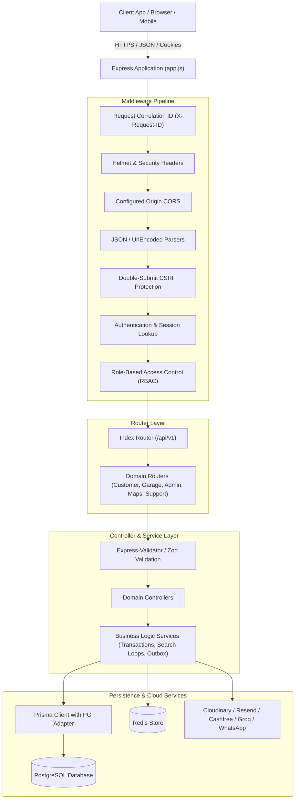
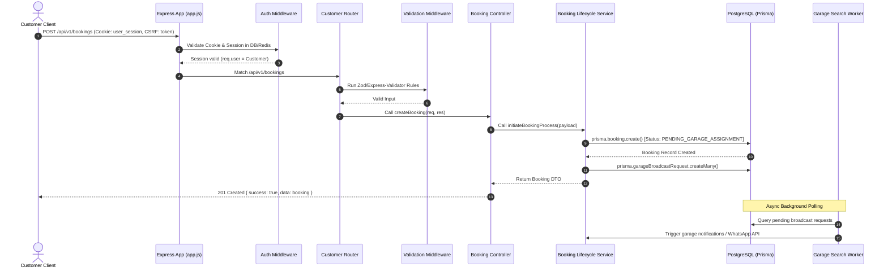

# 01. System Architecture

## 1. Executive Summary & Architectural Overview

The **Rovauto Backend** is engineered as a layered modular monolith built on **Node.js (>=22.0.0)** and **Express (v5.2.1)**. It leverages **Prisma ORM (v7.8.0)** with `@prisma/adapter-pg` over native PostgreSQL (`pg` driver) for data access, alongside **Redis (`ioredis` v5.11.1)** for high-speed caching, session management, and rate limiting.

---

## 2. Technology Stack Reference

| Technology Category | Library / Package | Version | Purpose & Architectural Justification |
| :--- | :--- | :--- | :--- |
| **Runtime Environment** | Node.js | `>=22.0.0` | Modern JS features, native fetch, high performance ES2024 features. |
| **HTTP Framework** | `express` | `^5.2.1` | Modern async error handling out of the box, robust routing. |
| **Database ORM** | `@prisma/client`, `prisma` | `^7.8.0` | Type-safe query building, migration management, multi-file schema support. |
| **PostgreSQL Adapter** | `@prisma/adapter-pg`, `pg` | `^7.8.0`, `^8.22.0` | High-performance connection pooling via native `pg` pool driver. |
| **In-Memory Cache** | `ioredis` | `^5.11.1` | Cache storage, rate limit storage, OTP attempt counters, session invalidation. |
| **Password Hashing** | `argon2` | `^0.44.0` | Memory-hard password hashing (Winner of Password Hashing Competition). |
| **Token Authentication** | `jsonwebtoken` | `^9.0.3` | JWT generation and verification for HttpOnly cookies and Bearer tokens. |
| **Validation Engines** | `express-validator`, `zod` | `^7.3.2`, `^4.4.3` | Dual validation approach: Express-validator for route middleware & Zod for internal schemas. |
| **Payment Gateway** | Cashfree SDK (HTTP integration) | N/A | PG Order creation, webhook validation, refund processing. |
| **Media Uploads** | `multer`, `cloudinary`, `streamifier` | `^2.2.0`, `^2.10.0`, `^0.1.1` | Memory-buffer file uploads directly streamed to Cloudinary CDN. |
| **AI LLM Integration** | `groq-sdk` | `^1.3.0` | High-speed inference for support chatbot assistant. |
| **Email Delivery** | `resend` | `^6.14.0` | Transactional email delivery for OTPs, garage applications, and support. |
| **Web Push Notifications**| `web-push` | `^3.6.7` | VAPID push notifications for PWA/Browser notifications. |
| **Push / Mobile Admin** | `firebase-admin` | `^14.1.0` | Mobile FCM notifications and auth verification. |
| **Security & Headers** | `helmet`, `cors`, `cookie-parser` | `^8.2.0`, `^2.8.6`, `^1.4.7` | Content Security Policy, strict origin CORS matching, signed HTTP cookies. |

---

## 3. High-Level Architectural Layers

---

## 4. End-to-End System Request Flow (Sequence Diagram)

---

## 5. Architectural Design Principles & Trade-offs

1. **Monolithic Simplicity with Modular Boundaries**: The repository is organized into distinct domain folders ([`src/admin`](file:///Users/prateek/Roavuto/server/src/admin), [`src/customer`](file:///Users/prateek/Roavuto/server/src/customer), [`src/garage`](file:///Users/prateek/Roavuto/server/src/garage), [`src/maps`](file:///Users/prateek/Roavuto/server/src/maps), [`src/customerSupport`](file:///Users/prateek/Roavuto/server/src/customerSupport)) sharing a single PostgreSQL database via Prisma ORM.
2. **Double-Submit CSRF & HttpOnly Cookie Sessions**: Authentication relies on secure, HttpOnly, SameSite-configured cookies for browser safety, backed by a CSRF middleware (`X-CSRF-Token` header validation).
3. **Outbox Pattern for Async Resilience**: Asynchronous operations like garage application emails (`GarageApplicationEmailOutbox`) are decoupled using database-backed outbox queues to ensure transactional reliability even if third-party APIs fail.
