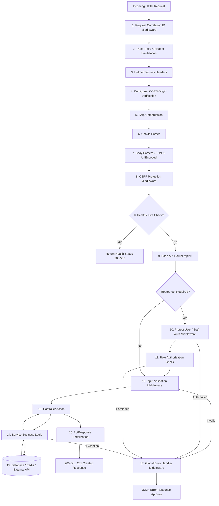
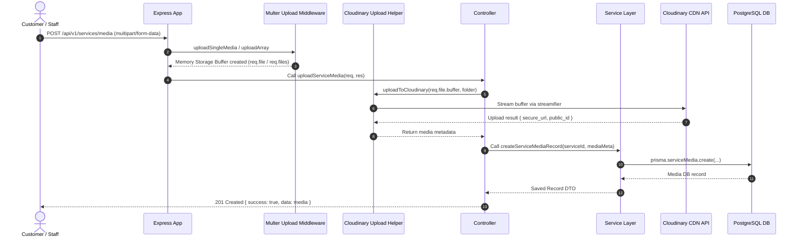
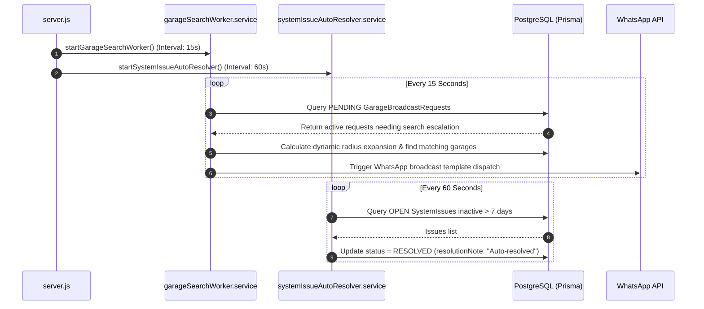

# 02. Request Lifecycle

## 1. Executive Summary

Every HTTP request entering the Rovauto backend undergoes a deterministic, multi-stage processing pipeline defined in [`app.js`](file:///Users/prateek/Roavuto/server/src/app.js). This document details the exact execution order, middleware execution, context propagation, error bubbling, and response serialization contracts.

---

## 2. Global Middleware Pipeline & Execution Order

When a request arrives at the server port, it passes through the following sequential pipeline:

---

## 3. Detailed Stage Breakdown

### Stage 1: Request Correlation ID Injection
Implemented in [`app.js:28-37`](file:///Users/prateek/Roavuto/server/src/app.js#L28-L37):
- Evaluates the incoming `x-request-id` header.
- Validates that the ID matches `/^[A-Za-z0-9_-]{8,64}$/`. If invalid or absent, generates a secure UUID via `crypto.randomUUID()`.
- Binds `req.requestId` and sets the `X-Request-ID` HTTP header on the outbound response.

### Stage 2: Security & Header Sanitization
- Sets `app.set("trust proxy", 1)` for proxy-aware IP resolution (e.g. behind Render or Cloudflare).
- Disables `x-powered-by` header.
- Applies [`helmet()`](file:///Users/prateek/Roavuto/server/src/app.js#L48-L57) configuring policies for `crossOriginOpenerPolicy` and `crossOriginResourcePolicy`.

### Stage 3: CORS Validation
- Dynamically validates origins against `allowedOrigins` (production domain whitelist & localhost dev patterns).
- Allows server-to-server requests without `Origin` headers (e.g. webhooks, cron workers).

### Stage 4: Body Parsing & Raw Body Retention
- `express.json({ limit: "1mb", verify: (req, res, buffer) => { req.rawBody = buffer; } })`: Parses JSON request payloads while storing the raw buffer on `req.rawBody` for webhook HMAC signature verification (e.g., WhatsApp Cloud API & Cashfree Webhooks).

### Stage 5: CSRF Protection
- Implemented in [`csrf.middleware.js`](file:///Users/prateek/Roavuto/server/src/middlewares/csrf.middleware.js).
- Protects unsafe HTTP methods (`POST`, `PUT`, `PATCH`, `DELETE`).
- Verifies the double-submit cookie pattern against `X-CSRF-Token` header.

### Stage 6: Authentication & Authorization
- Resolves session tokens from signed cookies or Bearer headers.
- Fetches active session from DB (`UserSession` or `StaffSession`) and attaches user payload to `req.user` or `req.staff`.
- Evaluates `authorizeRoles("CUSTOMER", "GARAGE_OWNER", "ADMIN")`.

### Stage 7: Controller & Service Execution
- Controllers wrap calls with [`asyncHandler`](file:///Users/prateek/Roavuto/server/src/utils/asyncHandler.js) or `try/catch` blocks.
- Services execute business rules, atomic database transactions (`prisma.$transaction`), and return plain JS objects or DTOs.

### Stage 8: Serialization & Error Handling
- Controllers format successful responses using [`ApiResponse`](file:///Users/prateek/Roavuto/server/src/utils/apiResponse.js): `{ success: true, statusCode, message, data }`.
- Errors thrown as [`ApiError`](file:///Users/prateek/Roavuto/server/src/utils/apiError.js) bubble to [`error.middleware.js`](file:///Users/prateek/Roavuto/server/src/middlewares/error.middleware.js), which maps status codes, logs detailed context, and returns sanitized JSON error objects.

---

## 4. Lifecycle Sequence Diagram: Multipart File Upload

---

## 5. Background Cron & Worker Execution Flow

Apart from HTTP request/response lifecycles, background execution flows run asynchronously in `server.js`:

