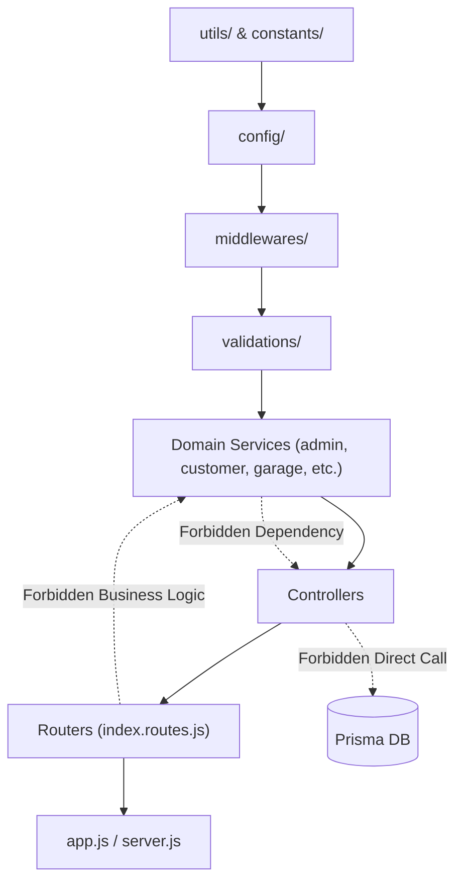

# 03. Folder Structure

## 1. Directory Tree Overview

The Rovauto backend source directory is located at [`server/src/`](file:///Users/prateek/Roavuto/server/src). The project employs a **hybrid architecture**: global cross-cutting infrastructure resides in top-level technical layers (`config/`, `middlewares/`, `utils/`, `constants/`), while core business logic is modularized by domain (`admin/`, `customer/`, `garage/`, `maps/`, `customerSupport/`).

```
server/
├── prisma/
│   ├── migrations/             # Sequential SQL migration files
│   └── schema.prisma           # Single source of database schema truth (62KB)
├── scripts/                    # Schema assertions, data cleanup, recovery drills
├── src/
│   ├── app.js                  # Express app setup, CORS, security, middleware pipeline
│   ├── server.js               # Entry point, database connections, background workers, shutdown
│   ├── admin/                  # Admin domain (Staff, approvals, system controls)
│   │   ├── controllers/
│   │   ├── middlewares/
│   │   ├── routes/
│   │   ├── services/
│   │   └── validations/
│   ├── customer/               # Customer domain (Auth, vehicles, bookings, payments, wallet)
│   │   ├── constants/
│   │   ├── controllers/
│   │   ├── knowledge/
│   │   ├── routes/
│   │   ├── security/
│   │   ├── services/
│   │   └── validations/
│   ├── customerSupport/        # Customer Support domain (Tickets, chat, LLM assistant)
│   │   ├── controllers/
│   │   ├── routes/
│   │   ├── services/
│   │   └── validations/
│   ├── garage/                 # Garage domain (Owner/controller auth, applications, worker tasks)
│   │   ├── controllers/
│   │   ├── routes/
│   │   ├── services/
│   │   └── validations/
│   ├── maps/                   # Geolocation, routing, distance matrix, spatial indexing
│   │   ├── controllers/
│   │   ├── routes/
│   │   ├── services/
│   │   └── validations/
│   ├── config/                 # Environment variables, database clients, third-party initializations
│   ├── constants/              # Shared enums, statuses, roles, fulfillment modes
│   ├── controllers/            # Core shared controllers (City, Garage, Worker Tasks, Push, Public)
│   ├── middlewares/            # Authentication, RBAC, CSRF, Rate Limiting, File Uploads
│   ├── routes/                 # Master routing table (index.routes.js) and shared routes
│   ├── scripts/                # In-app utility scripts (nuke user data, approve applications)
│   ├── seed/                   # Database seeders (Admin, Intern, initial services)
│   ├── services/               # Shared domain services (Booking lifecycle, Search worker, System issues)
│   ├── utils/                  # Reusable utility modules (API error, cache, phone format, distance)
│   └── validations/            # Shared input validation schemas
└── test/                      # Node.js native test runner test cases (security suite)
```

---

## 2. Detailed Directory Breakdown & Responsibilities

| Directory Path | Primary Responsibility | Key Files / Subdirectories | Owned Architectural Layer |
| :--- | :--- | :--- | :--- |
| [`server/src/app.js`](file:///Users/prateek/Roavuto/server/src/app.js) | Configures Express server instance, registers global middlewares, sets up CORS, health check endpoints, mounted `/api/v1` routes. | `app.js` | Express Setup / Middleware Pipeline |
| [`server/src/server.js`](file:///Users/prateek/Roavuto/server/src/server.js) | Server entry point. Bootstraps DB/Redis connections, starts background workers, handles process signals (`SIGTERM`, `SIGINT`) & graceful shutdown. | `server.js` | Infrastructure / Process Manager |
| [`server/src/config/`](file:///Users/prateek/Roavuto/server/src/config) | Manages client instances for external services and environment validation. | `prisma.js`, `redis.js`, `env.js`, `cloudinary.js`, `cashfree.js`, `firebase.js` | Configuration & Adapters |
| [`server/src/routes/`](file:///Users/prateek/Roavuto/server/src/routes) | Master route hub. Mounts domain routers under `/api/v1`. | `index.routes.js`, `city.routes.js`, `garage.routes.js`, `whatsapp.routes.js` | Routing Layer |
| [`server/src/middlewares/`](file:///Users/prateek/Roavuto/server/src/middlewares) | Provides request isolation, authentication, RBAC, rate limiting, file upload handling, and global error management. | `auth.middleware.js`, `role.middleware.js`, `csrf.middleware.js`, `rateLimit.middleware.js`, `upload.middleware.js`, `error.middleware.js` | Cross-Cutting Security & Infrastructure |
| [`server/src/admin/`](file:///Users/prateek/Roavuto/server/src/admin) | Encapsulates staff administration, garage onboarding verification, city-level pricing rules, car metadata, audit logs. | `routes/`, `controllers/`, `services/`, `validations/`, `middlewares/` | Domain Module (Admin) |
| [`server/src/customer/`](file:///Users/prateek/Roavuto/server/src/customer) | Encapsulates vehicle owners' features: vehicle garage, discovery, booking creation, payments, wallet, reviews, complaints. | `routes/`, `controllers/`, `services/`, `validations/`, `knowledge/` | Domain Module (Customer) |
| [`server/src/garage/`](file:///Users/prateek/Roavuto/server/src/garage) | Encapsulates garage owner portal, automated garage controllers, worker task creation, tokenized task links. | `routes/`, `controllers/`, `services/`, `validations/` | Domain Module (Garage) |
| [`server/src/customerSupport/`](file:///Users/prateek/Roavuto/server/src/customerSupport) | Encapsulates ticket claiming, dispute resolutions, Groq AI assistant integration, and support agent notifications. | `routes/`, `controllers/`, `services/`, `validations/` | Domain Module (Support) |
| [`server/src/maps/`](file:///Users/prateek/Roavuto/server/src/maps) | Encapsulates reverse geocoding, bounding-box spatial searches, distance matrix calculations, map route plotting. | `routes/`, `controllers/`, `services/`, `validations/` | Domain Module (Maps) |
| [`server/src/services/`](file:///Users/prateek/Roavuto/server/src/services) | Root business logic services shared across domains (Booking lifecycle engine, garage search worker, system issue reporter). | `bookingLifecycle.service.js`, `garageSearchWorker.service.js`, `webPush.service.js` | Business Logic Engine |
| [`server/src/utils/`](file:///Users/prateek/Roavuto/server/src/utils) | Pure utility functions and helpers for data transformations, cache invalidations, and geometry calculations. | `apiError.js`, `apiResponse.js`, `distance.js`, `phone.js`, `cache.js`, `jwt.js` | Utilities & Helpers |

---

## 3. Cross-Module Import & Architectural Boundary Rules

To maintain maintainability and avoid circular dependencies, the codebase enforces the following architectural boundaries:



1. **Controllers must never access Prisma DB directly**: Controllers call Services to perform database operations.
2. **Services must not depend on HTTP objects**: Services receive plain primitives or objects, avoiding dependencies on Express `req` or `res`.
3. **No direct inter-controller dependencies**: Controllers must not call other controllers directly; shared logic must be refactored into services or utilities.
