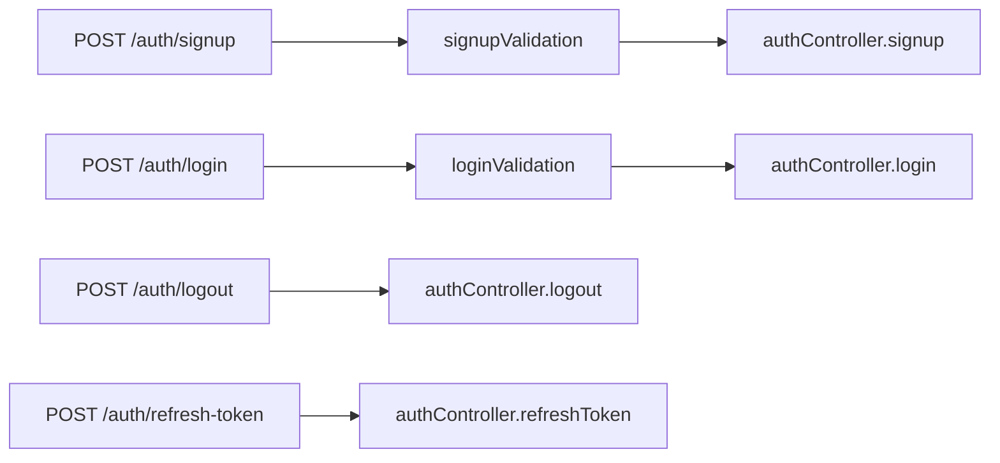
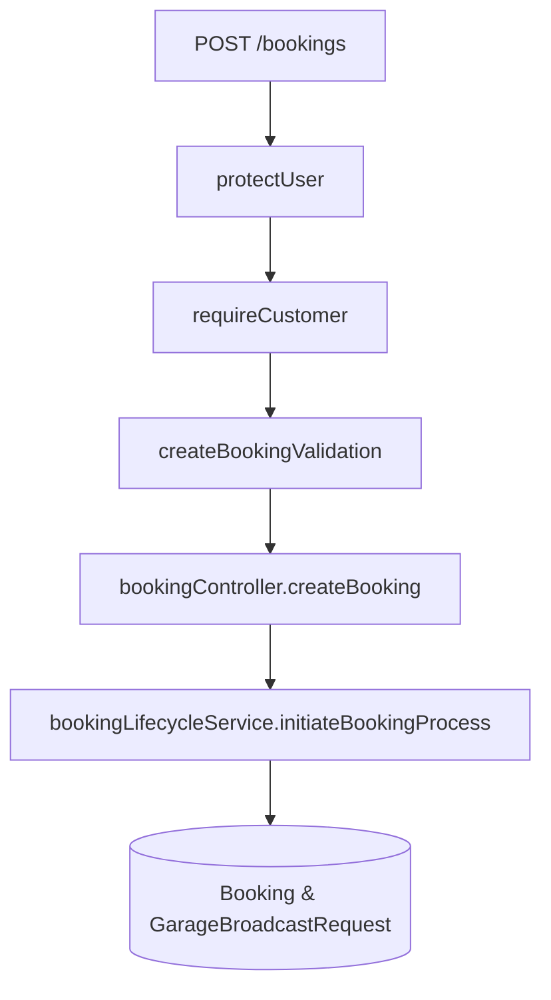

# 04. Complete Router Reference

## 1. Overview & Router Mounting Hierarchy

All API endpoints are exposed under the base prefix `/api/v1`, mounted in [`server/src/routes/index.routes.js`](file:///Users/prateek/Roavuto/server/src/routes/index.routes.js).

The router mounting structure enforces strict middleware isolation:
- Global Admin Audit Middleware (`adminAuditMiddleware`) intercepts all authenticated staff mutations across shared `/cities` and `/garages` routes.
- Public routes (`/auth`, `/public`, `/system-issues`, `/cities`, `/maps`, `/locations`) are accessible without session authentication.
- Customer routes (`/customer`, `/vehicles`, `/notifications`, `/bookings`, `/payments`, `/wallet`, `/sos`, etc.) enforce `protectUser` + `authorizeRoles("CUSTOMER")`.
- Staff / Admin routes (`/admin/*`) enforce `protectStaff` + `authorizeStaffRoles(...)`.

---

## 2. Master Router Summary Table

Below is the comprehensive inventory of all primary router modules mounted in [`index.routes.js`](file:///Users/prateek/Roavuto/server/src/routes/index.routes.js):

| Base Path | Router Module File | Auth Requirements | Primary Domain & Controller |
| :--- | :--- | :--- | :--- |
| `/api/v1/auth` | [`customer/routes/auth.routes.js`](file:///Users/prateek/Roavuto/server/src/customer/routes/auth.routes.js) | Public / Refresh Cookie | Customer Signup, OTP, Login, Logout, Token Refresh |
| `/api/v1/public` | [`routes/public.routes.js`](file:///Users/prateek/Roavuto/server/src/routes/public.routes.js) | Public | Platform stats, banner images, public metadata |
| `/api/v1/cities` | [`routes/city.routes.js`](file:///Users/prateek/Roavuto/server/src/routes/city.routes.js) | Public (GET), Staff (POST/PUT) | City listings, active city service boundaries |
| `/api/v1/maps` | [`maps/routes/maps.routes.js`](file:///Users/prateek/Roavuto/server/src/maps/routes/maps.routes.js) | Public / Customer | Geocoding, reverse geocoding, distance matrix |
| `/api/v1/locations` | [`customer/routes/location.routes.js`](file:///Users/prateek/Roavuto/server/src/customer/routes/location.routes.js) | Mixed (Public lookup, Customer auth for saved) | Saved customer addresses, geocoding |
| `/api/v1/customer` | [`customer/routes/customer.routes.js`](file:///Users/prateek/Roavuto/server/src/customer/routes/customer.routes.js) | Protected (`CUSTOMER`) | Customer profile, password, preference management |
| `/api/v1/vehicles` | [`customer/routes/vehicle.routes.js`](file:///Users/prateek/Roavuto/server/src/customer/routes/vehicle.routes.js) | Protected (`CUSTOMER`) | Vehicle garage management (Add, edit, list, delete) |
| `/api/v1/vehicle-meta` | [`customer/routes/vehicleMeta.routes.js`](file:///Users/prateek/Roavuto/server/src/customer/routes/vehicleMeta.routes.js) | Public | Vehicle brands and models catalog |
| `/api/v1/services` | [`customer/routes/service.routes.js`](file:///Users/prateek/Roavuto/server/src/customer/routes/service.routes.js) | Public / Customer | Service categories, service catalog, price range estimates |
| `/api/v1/garages` | [`routes/garage.routes.js`](file:///Users/prateek/Roavuto/server/src/routes/garage.routes.js) | Public / Customer | Nearby garage discovery, garage details, reviews |
| `/api/v1/garage/applications` | [`garage/routes/application.routes.js`](file:///Users/prateek/Roavuto/server/src/garage/routes/application.routes.js) | Public | Garage partner onboarding application submission |
| `/api/v1/bookings` | [`customer/routes/booking.routes.js`](file:///Users/prateek/Roavuto/server/src/customer/routes/booking.routes.js) | Protected (`CUSTOMER`) | Booking creation, tracking, cancellation, history |
| `/api/v1/payments` | [`customer/routes/payment.routes.js`](file:///Users/prateek/Roavuto/server/src/customer/routes/payment.routes.js) | Protected (`CUSTOMER`) | Cashfree order creation, payment status verification |
| `/api/v1/wallet` | [`customer/routes/wallet.routes.js`](file:///Users/prateek/Roavuto/server/src/customer/routes/wallet.routes.js) | Protected (`CUSTOMER`) | Customer wallet balance, deposit, transaction history |
| `/api/v1/garage/requests` | [`routes/garageRequest.routes.js`](file:///Users/prateek/Roavuto/server/src/routes/garageRequest.routes.js) | Protected (`GARAGE_OWNER` / `CONTROLLER`) | Accept/reject broadcast requests, active job execution |
| `/api/v1/garage/worker-tasks`| [`routes/garageWorkerTask.routes.js`](file:///Users/prateek/Roavuto/server/src/routes/garageWorkerTask.routes.js) | Protected (`GARAGE_OWNER` / `CONTROLLER`) | Create tokenized worker tasks for pickup/drop-off |
| `/api/v1/worker-tasks` | [`routes/publicWorkerTask.routes.js`](file:///Users/prateek/Roavuto/server/src/routes/publicWorkerTask.routes.js) | Public (Worker Token) | Worker task portal: view task, submit tracking points |
| `/api/v1/customer-support` | [`customerSupport/routes/customerSupport.routes.js`](file:///Users/prateek/Roavuto/server/src/customerSupport/routes/customerSupport.routes.js) | Protected (`CUSTOMER_SUPPORT`) | Ticket claim, chat, refund processing |
| `/api/v1/admin/*` | [`admin/routes/*`](file:///Users/prateek/Roavuto/server/src/admin/routes) | Protected Staff (`ADMIN`, `SUB_ADMIN`, `INTERN`) | Admin control center, approvals, city price ranges, audit logs |

---

## 3. Detailed Endpoint Reference by Domain

### 3.1 Authentication & Profile Router ([`customer/routes/auth.routes.js`](file:///Users/prateek/Roavuto/server/src/customer/routes/auth.routes.js))

| HTTP Verb | Path | Auth Level | Middleware / Validation | Controller Method | Target Services & DB Tables |
| :--- | :--- | :--- | :--- | :--- | :--- |
| `POST` | `/auth/signup` | Public | `signupValidation`, `validate` | `authController.signup` | `authService.signupCustomer` -> `User`, `CustomerProfile`, `Wallet` |
| `POST` | `/auth/login` | Public | `loginValidation`, `validate` | `authController.login` | `authService.loginCustomer` -> `User`, `UserSession` |
| `POST` | `/auth/logout` | Public | Cookie Parser | `authController.logout` | `authService.logoutCustomer` -> `UserSession` |
| `POST` | `/auth/refresh-token` | Public | Cookie Parser | `authController.refreshToken` | `authService.refreshCustomerToken` -> `UserSession` |

---

### 3.2 Booking Lifecycle Router ([`customer/routes/booking.routes.js`](file:///Users/prateek/Roavuto/server/src/customer/routes/booking.routes.js))

| HTTP Verb | Path | Auth Level | Middleware / Validation | Controller Method | Business Logic & DB Impact |
| :--- | :--- | :--- | :--- | :--- | :--- |
| `POST` | `/bookings` | `CUSTOMER` | `protectUser`, `requireCustomer`, `createBookingValidation` | `bookingController.createBooking` | Creates booking in `PENDING_GARAGE_ASSIGNMENT`, broadcasts to nearby garages. Tables: `Booking`, `BookingService`, `GarageBroadcastRequest`. |
| `GET` | `/bookings` | `CUSTOMER` | `protectUser`, `requireCustomer` | `bookingController.getUserBookings` | Fetches customer bookings with pagination. Tables: `Booking`, `Garage`, `BookingService`. |
| `GET` | `/bookings/:id` | `CUSTOMER` | `protectUser`, `requireCustomer` | `bookingController.getBookingById` | Retrieves complete booking details including tracking points and inspection images. |
| `POST` | `/bookings/:id/cancel` | `CUSTOMER` | `protectUser`, `requireCustomer` | `bookingController.cancelBooking` | Cancels booking if in eligible status, releases allocated garage slot. |
| `GET` | `/bookings/:id/tracking` | `CUSTOMER` | `protectUser`, `requireCustomer` | `bookingController.getBookingTracking` | Fetches live tracking points for pickup/drop-off journey. Tables: `BookingTrackingPoint`. |

---

### 3.3 Garage Application Router ([`garage/routes/application.routes.js`](file:///Users/prateek/Roavuto/server/src/garage/routes/application.routes.js))

| HTTP Verb | Path | Auth Level | Middleware / Validation | Controller Method | Business Logic & Outbox Impact |
| :--- | :--- | :--- | :--- | :--- | :--- |
| `POST` | `/garage/applications` | Public | `uploadArray("images", 10)`, `garageApplicationValidation` | `garageApplicationController.submitApplication` | Uploads images to Cloudinary, creates `GarageApplication` and queues email in `GarageApplicationEmailOutbox`. |
| `GET` | `/garage/applications/status` | Public | Query param `phone` or `email` | `garageApplicationController.checkStatus` | Fetches application status for applicant tracking. |
