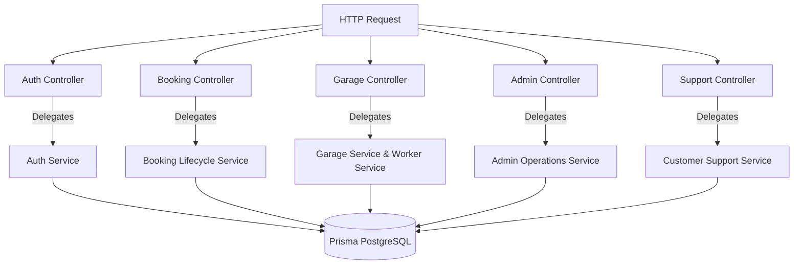

# 05. Controller Reference

## 1. Role & Architectural Responsibilities

In the Rovauto backend, **Controllers** sit between the router/middleware layer and the service layer. 

Controllers are strictly responsible for:
1. **Extracting Inputs**: Reading values from `req.params`, `req.query`, `req.body`, `req.user`, `req.staff`, `req.file`, or `req.files`.
2. **Delegating to Services**: Passing cleaned primitives and DTOs into domain services. Controllers **never** execute raw database queries directly.
3. **HTTP Response Orchestration**: Structuring outbound JSON payloads using [`ApiResponse`](file:///Users/prateek/Roavuto/server/src/utils/apiResponse.js) with standard HTTP status codes (`200 OK`, `201 Created`, `204 No Content`).
4. **Cookie & Header Management**: Setting HttpOnly session cookies (`user_session`, `staff_session`, `garage_owner_session`) and CSRF tokens.

---

## 2. Core Controller Inventory & Orchestration Matrix

---

## 3. Detailed Controller Breakdown

### 3.1 Authentication Controller ([`customer/controllers/auth.controller.js`](file:///Users/prateek/Roavuto/server/src/customer/controllers/auth.controller.js))

- **Functions**: `signup`, `login`, `logout`, `refreshToken`, `sendPhoneOtp`, `verifyPhoneOtp`, `getProfile`.
- **Expected Inputs**:
  - `signup`: `{ fullName, email, phone, password, city }`
  - `login`: `{ email, password }` or `{ phone, otp }`
  - `sendPhoneOtp`: `{ phone, purpose: "LOGIN" | "SIGNUP" }`
- **Expected Outputs**: `{ user: CustomerDTO }` plus `Set-Cookie` header for `user_session`.
- **Exceptions Thrown**: `ApiError(400, "Invalid credentials")`, `ApiError(409, "Email/Phone already exists")`.
- **Orchestration Flow**:
  1. Validates OTP or password hash via `authService`.
  2. Creates session entry in `UserSession` table and Redis.
  3. Formats signed HttpOnly cookie `user_session` via `authCookieConfig`.
  4. Returns sanitized `User` object (excluding password hash).

---

### 3.2 Booking Controller ([`customer/controllers/booking.controller.js`](file:///Users/prateek/Roavuto/server/src/customer/controllers/booking.controller.js))

- **Functions**: `createBooking`, `getUserBookings`, `getBookingById`, `cancelBooking`, `getBookingTracking`.
- **Expected Inputs**:
  - `createBooking`: `{ vehicleId, serviceIds, locationId, scheduledDate, timeSlot, fulfillmentType }`
- **Expected Outputs**: `{ booking: BookingDTO, broadcastCount: number }`.
- **Exceptions Thrown**: `ApiError(404, "Vehicle/Location not found")`, `ApiError(400, "No active garages in radius")`.
- **Service Dependencies**: [`bookingLifecycle.service.js`](file:///Users/prateek/Roavuto/server/src/services/bookingLifecycle.service.js), [`maps.service.js`](file:///Users/prateek/Roavuto/server/src/maps/services/maps.service.js).

---

### 3.3 Garage Request Controller ([`controllers/garageRequest.controller.js`](file:///Users/prateek/Roavuto/server/src/controllers/garageRequest.controller.js))

- **Functions**: `getPendingRequests`, `acceptRequest`, `rejectRequest`, `updateJobStatus`, `completeJob`.
- **Expected Inputs**:
  - `acceptRequest`: `params.requestId`, `{ garageOwnerId }`
  - `updateJobStatus`: `params.bookingId`, `{ status: "IN_PROGRESS" | "WORK_COMPLETED" }`
- **Expected Outputs**: `{ booking: UpdatedBookingDTO, nextStep: string }`.
- **Orchestration Flow**:
  1. Verifies garage owner/controller authorization for the target garage.
  2. Executes state transition inside `garageRequestService.acceptBroadcastRequest`.
  3. Triggers customer notification via `webPushService` or `whatsappService`.

---

### 3.4 Admin Control Center Controller ([`admin/controllers/adminControlCenter.controller.js`](file:///Users/prateek/Roavuto/server/src/admin/controllers/adminControlCenter.controller.js))

- **Functions**: `getDashboardOverview`, `approveGarageApplication`, `rejectGarageApplication`, `updateCityPriceRange`, `purgeStaleSessions`.
- **Expected Inputs**:
  - `approveGarageApplication`: `params.applicationId`, `{ workingRadiusKm, initialServices }`
- **Expected Outputs**: `{ garage: CreatedGarageDTO, credentialsSent: boolean }`.
- **Exceptions Thrown**: `ApiError(404, "Application not found")`, `ApiError(400, "Application already processed")`.
- **Service Dependencies**: [`garageApplication.service.js`](file:///Users/prateek/Roavuto/server/src/admin/services/garageApplication.service.js), [`adminAudit.middleware.js`](file:///Users/prateek/Roavuto/server/src/admin/middlewares/adminAudit.middleware.js).
