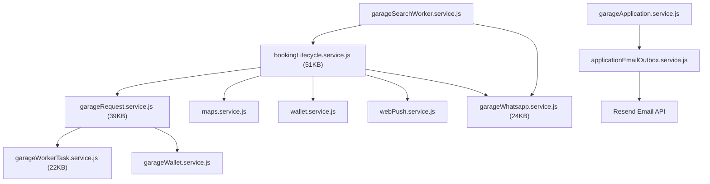
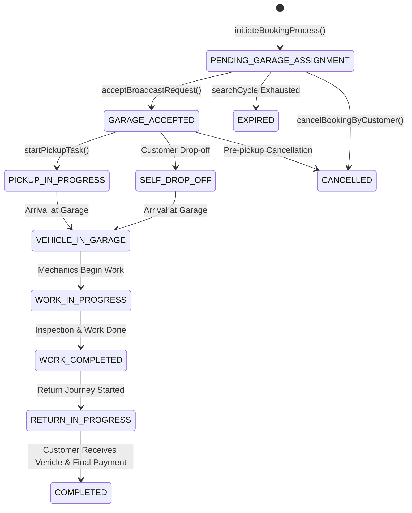

# 06. Services Reference

## 1. Executive Summary & Architectural Role

The **Service Layer** represents the heart of the Rovauto backend. All complex business rules, multi-table database transactions (`prisma.$transaction`), spatial location algorithms, third-party integrations (Cashfree, Cloudinary, Groq, WhatsApp, Resend), background worker loops, and notification dispatches reside within services.

Services are modularized into root shared services ([`server/src/services/`](file:///Users/prateek/Roavuto/server/src/services)) and domain-specific services under `admin/`, `customer/`, `garage/`, `maps/`, and `customerSupport/`.

---

## 2. Core Service Dependency & Interaction Map

---

## 3. Deep Dive Technical Analysis of Key Services

### 3.1 Booking Lifecycle Service ([`services/bookingLifecycle.service.js`](file:///Users/prateek/Roavuto/server/src/services/bookingLifecycle.service.js))

- **File Size**: 51,132 bytes (~51 KB).
- **Primary Responsibility**: Complete lifecycle orchestration for customer service bookings from creation, garage broadcasting, assignment, status progression, tracking, to payment settlement.
- **Key Methods**:
  - `initiateBookingProcess(customerId, bookingData)`: Validates active user, vehicle ownership, customer location, calculates estimated price ranges, creates `Booking` in `PENDING_GARAGE_ASSIGNMENT`, and queries nearby garages.
  - `findNearbyGaragesForBroadcast(latitude, longitude, serviceCategoryIds, radiusKm)`: Executes Haversine spatial query filtering garages matching operational status `ACTIVE`, terms accepted, and offering required services.
  - `transitionBookingStatus(bookingId, newStatus, actorPayload)`: Performs state validation preventing illegal status jumps (e.g. `COMPLETED` -> `CANCELLED`), updates timestamp fields (`confirmedAt`, `startedAt`, `completedAt`), and logs `BookingEvent`.
  - `cancelBookingByCustomer(bookingId, userId, reason)`: Validates cancellation eligibility, releases any reserved garage broadcast requests, and issues a wallet refund if payment was already processed.

---

### 3.2 Garage Broadcast Request Service ([`services/garageRequest.service.js`](file:///Users/prateek/Roavuto/server/src/services/garageRequest.service.js))

- **File Size**: 39,686 bytes (~39 KB).
- **Primary Responsibility**: Manages garage partner job offers, broadcast acceptances, controller dispatching, and race condition prevention when multiple garages attempt to accept the same broadcast.
- **Concurrency & Concurrency Control**:
  - Employs atomic database transactions (`prisma.$transaction` with SERIALIZABLE / READ COMMITTED isolations) during `acceptBroadcastRequest()`.
  - Checks if `Booking.garageId` is already set. If another garage accepted first, gracefully updates the losing broadcast request to `EXPIRED` and returns `ApiError(409, "Booking already accepted by another garage")`.

---

### 3.3 Garage Search Worker Service ([`services/garageSearchWorker.service.js`](file:///Users/prateek/Roavuto/server/src/services/garageSearchWorker.service.js))

- **Primary Responsibility**: Asynchronous background loop that drives booking assignment expansion.
- **Worker Loop Algorithm**:
  1. Runs every 15 seconds (`INTERVAL_MS = 15_000`).
  2. Queries all bookings with status `PENDING_GARAGE_ASSIGNMENT` where `createdAt` is within the last 15 minutes.
  3. Evaluates current search cycle and radius expansion step (e.g. 5 km -> 10 km -> 15 km).
  4. If new candidate garages are discovered, creates additional `GarageBroadcastRequest` records and triggers dispatch notifications via `garageWhatsapp.service.js`.
  5. If max search cycle is reached with zero acceptances, marks booking as `SEARCH_EXHAUSTED` and notifies customer support.

---

### 3.4 Garage Worker Task Service ([`services/garageWorkerTask.service.js`](file:///Users/prateek/Roavuto/server/src/services/garageWorkerTask.service.js))

- **File Size**: 22,584 bytes (~22 KB).
- **Primary Responsibility**: Tokenized worker logistics for vehicle pickup, drop-off, and live GPS tracking.
- **Key Methods**:
  - `createWorkerTask(garageId, bookingId, taskType, workerName, workerPhone)`: Generates a cryptographically secure random token, hashes the token using SHA-256 (`tokenHash`), sets expiration time (e.g. 12 hours), and returns the raw task URL link (`/task/:token`).
  - `recordTrackingPoint(token, latitude, longitude, heading, speed)`: Validates worker token hash, inserts a new `BookingTrackingPoint`, and updates the latest worker position.

---

### 3.5 System Issue Reporter & Auto-Resolver Services ([`services/systemIssueReporter.service.js`](file:///Users/prateek/Roavuto/server/src/services/systemIssueReporter.service.js) & [`systemIssueAutoResolver.service.js`](file:///Users/prateek/Roavuto/server/src/services/systemIssueAutoResolver.service.js))

- **Primary Responsibility**: Internal error logging, exception fingerprinting, deduplication, and automatic issue resolution.
- **Fingerprinting Algorithm**:
  - Computes an MD5/SHA-256 hash based on `errorName + message + stackFirstLine + route`.
  - Increments `occurrenceCount` and updates `lastSeenAt` if the issue already exists in `SystemIssue`.
- **Auto-Resolver Loop**:
  - Runs every 60 seconds. Resolves open issues of severity `INFO` or `WARNING` that have seen no new occurrences for over 7 days.

---

### 3.6 Web Push & WhatsApp Notification Services ([`services/webPush.service.js`](file:///Users/prateek/Roavuto/server/src/services/webPush.service.js) & [`services/garageWhatsapp.service.js`](file:///Users/prateek/Roavuto/server/src/services/garageWhatsapp.service.js))

- **Primary Responsibility**: Delivering push notifications to customer browsers via Web Push (VAPID keys) and sending Meta WhatsApp templates to garage owners upon new broadcast dispatches.
