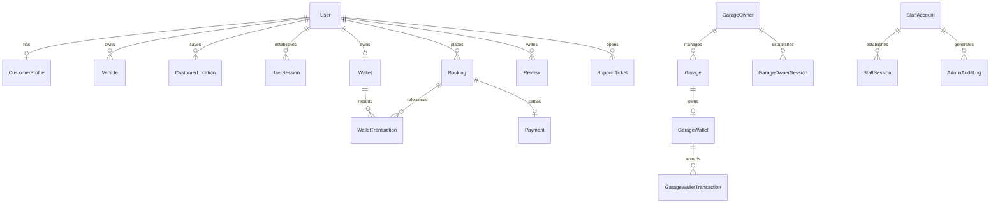
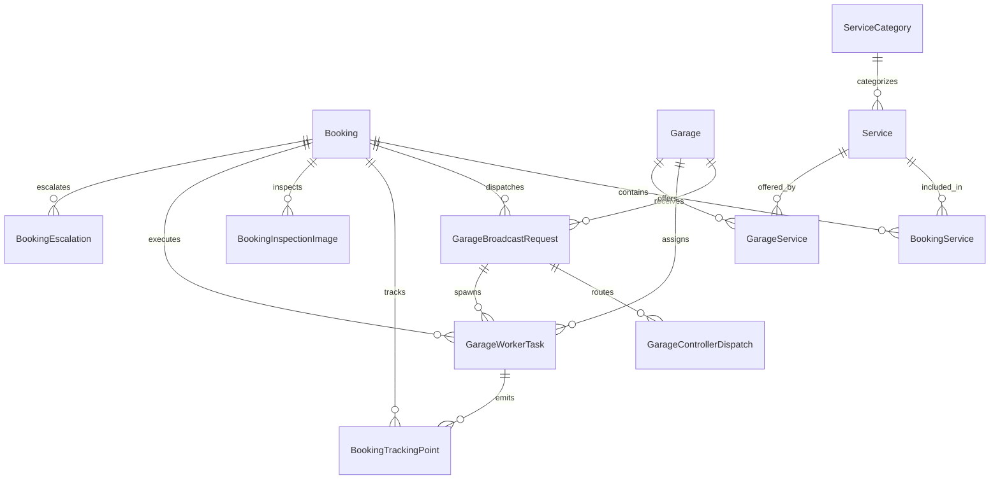

# 07. Database Documentation

## 1. Database Architecture & Technology Overview

The Rovauto backend uses **PostgreSQL** as its primary relational database, managed via **Prisma ORM (v7.8.0)**. 

### Key Technical Characteristics:
- **Prisma Engine**: Configured with `@prisma/adapter-pg` driver adapter, allowing Prisma to execute over native Node.js `pg` connection pools.
- **Connection Configuration**: Location: [`server/src/config/prisma.js`](file:///Users/prateek/Roavuto/server/src/config/prisma.js).
- **Schema Location**: [`server/prisma/schema.prisma`](file:///Users/prateek/Roavuto/server/prisma/schema.prisma) (62 KB total size, 1,967 lines).
- **Data Integrity Constraints**: Foreign keys use explicit onDelete strategies (`Cascade` for child dependencies, `SetNull` for optional audit/assignee pointers).

---

## 2. Complete Entity-Relationship Diagrams (ERD)

### 2.1 Core Identity, Authentication & Wallet ERD

---

### 2.2 Booking, Logistics & Worker Task ERD

---

## 3. Comprehensive Prisma Model Inventory

Below is the complete reference of core database entities defined in [`schema.prisma`](file:///Users/prateek/Roavuto/server/prisma/schema.prisma):

### 3.1 Primary User & Identity Models

| Model Name | Table Name (`@@map`) | Primary Key | Key Fields | Key Relations | Indexes & Constraints |
| :--- | :--- | :--- | :--- | :--- | :--- |
| `User` | `users` | `id` (UUID) | `email`, `phone`, `password`, `role` | `CustomerProfile`, `Vehicle`, `UserSession`, `Wallet`, `Booking` | `@@unique([email])`, `@@unique([phone])` |
| `CustomerProfile` | `customer_profiles` | `id` (UUID) | `userId`, `fullName`, `avatarUrl` | `User` | `@@unique([userId])` |
| `UserSession` | `user_sessions` | `id` (UUID) | `userId`, `sessionToken`, `expiresAt` | `User` | `@@unique([sessionToken])`, `@@index([userId])` |
| `GarageOwner` | `garage_owners` | `id` (UUID) | `email`, `phone`, `password`, `fullName` | `Garage`, `GarageOwnerSession` | `@@unique([email])`, `@@unique([phone])` |
| `GarageController` | `garage_controllers` | `id` (UUID) | `garageId`, `loginId`, `password`, `name` | `Garage`, `GarageControllerDispatch` | `@@unique([loginId])`, `@@index([garageId])` |
| `StaffAccount` | `staff_accounts` | `id` (UUID) | `email`, `role`, `fullName`, `isActive` | `StaffSession`, `AdminAuditLog` | `@@unique([email])` |
| `CustomerSupportAccount` | `customer_support_accounts` | `id` (UUID) | `loginId`, `email`, `fullName` | `CustomerSupportSession`, `SupportTicket` | `@@unique([loginId])`, `@@unique([email])` |

---

### 3.2 Garage & Service Catalog Models

| Model Name | Table Name | Primary Key | Purpose & Key Relations | Indexes & Constraints |
| :--- | :--- | :--- | :--- | :--- |
| `Garage` | `garages` | `id` (UUID) | Active approved garages. Maps to `GarageOwner`, `GarageService`, `Booking`, `GarageWallet`. | `@@index([latitude, longitude])`, `@@index([status])` |
| `GarageApplication` | `garage_applications` | `id` (UUID) | Onboarding applications. Maps to `GarageApplicationImage`, `GarageApplicationEmailOutbox`. | `@@index([status])`, `@@index([email])`, `@@index([phone])` |
| `ServiceCategory` | `service_categories` | `id` (UUID) | Service grouping (e.g. Periodic Maintenance, Tyres, AC Repair). Maps to `Service`. | `@@unique([slug])` |
| `Service` | `services` | `id` (UUID) | Master service catalog. Maps to `ServiceCategory`, `GarageService`, `BookingService`. | `@@index([categoryId])`, `@@index([isActive])` |
| `GarageService` | `garage_services` | `id` (UUID) | Price & availability overrides for a garage service. Maps to `Garage`, `Service`. | `@@unique([garageId, serviceId])` |
| `CityServicePriceRange` | `city_service_price_ranges` | `id` (UUID) | City-level min/max price range parameters for services. | `@@unique([city, serviceId, vehicleBrand, vehicleModel, fuelType])` |

---

### 3.3 Booking & Logistics Models

| Model Name | Table Name | Primary Key | Key Relations & Delete Behaviors | Indexes |
| :--- | :--- | :--- | :--- | :--- |
| `Booking` | `bookings` | `id` (UUID) | Main booking record. Belongs to `User`, `Garage` (optional), `Vehicle`, `CustomerLocation`. | `@@index([userId, createdAt])`, `@@index([garageId, status])`, `@@index([bookingCode])` |
| `BookingService` | `booking_services` | `id` (UUID) | Services included in a booking. Belongs to `Booking` (Cascade), `Service`. | `@@unique([bookingId, serviceId])` |
| `GarageBroadcastRequest` | `garage_broadcast_requests` | `id` (UUID) | Broadcaster offers sent to garages. Belongs to `Booking` (Cascade), `Garage` (Cascade). | `@@unique([bookingId, garageId])`, `@@index([status])` |
| `GarageWorkerTask` | `garage_worker_tasks` | `id` (UUID) | Pickup/drop-off worker tasks. Contains hashed URL token (`tokenHash`). | `@@unique([tokenHash])`, `@@index([garageId, status, expiresAt])` |
| `BookingTrackingPoint` | `booking_tracking_points` | `id` (UUID) | GPS coordinate logs emitted by worker mobile devices or customer app. | `@@index([bookingId, recordedAt])`, `@@index([workerTaskId, recordedAt])` |

---

### 3.4 Payment & Wallet Models

| Model Name | Table Name | Primary Key | Purpose | Indexes & Unique Constraints |
| :--- | :--- | :--- | :--- | :--- |
| `Payment` | `payments` | `id` (UUID) | Cashfree gateway order settlement for a booking. | `@@unique([bookingId])`, `@@unique([cashfreeOrderId])` |
| `Wallet` | `wallets` | `id` (UUID) | Customer escrow wallet balance in integer paise/rupees. | `@@unique([userId])` |
| `WalletTransaction` | `wallet_transactions` | `id` (UUID) | Customer ledger entries (`CREDIT`, `DEBIT`). | `@@unique([idempotencyKey])`, `@@index([walletId])` |
| `GarageWallet` | `garage_wallets` | `id` (UUID) | Garage partner wallet balance. | `@@unique([garageId])` |
| `GarageWalletTransaction` | `garage_wallet_transactions` | `id` (UUID) | Garage ledger entries (`EARNING`, `WITHDRAWAL`). | `@@unique([idempotencyKey])`, `@@index([garageWalletId])` |

---

## 4. Primary Enumerations Reference

The schema defines 35 distinct enums in [`schema.prisma:1540-1967`](file:///Users/prateek/Roavuto/server/prisma/schema.prisma#L1540-L1967).

- **`Role`**: `CUSTOMER`, `GARAGE_OWNER`, `GARAGE_CONTROLLER`, `ADMIN`
- **`StaffRole`**: `ADMIN`, `SUB_ADMIN`, `INTERN`
- **`BookingStatus`**: `PENDING_GARAGE_ASSIGNMENT`, `GARAGE_ACCEPTED`, `PICKUP_IN_PROGRESS`, `SELF_DROP_OFF`, `VEHICLE_IN_GARAGE`, `WORK_IN_PROGRESS`, `WORK_COMPLETED`, `RETURN_IN_PROGRESS`, `COMPLETED`, `CANCELLED`, `EXPIRED`
- **`GarageApplicationStatus`**: `PENDING`, `CHANGES_REQUESTED`, `APPROVED`, `DENIED`
- **`PaymentStatus`**: `CREATED`, `PENDING`, `PAID`, `FAILED`, `REFUNDED`
- **`GarageWorkerTaskType`**: `PICKUP`, `RETURN`
- **`GarageWorkerTaskStatus`**: `ACTIVE`, `OPENED`, `STARTED`, `COMPLETED`, `REVOKED`, `EXPIRED`
