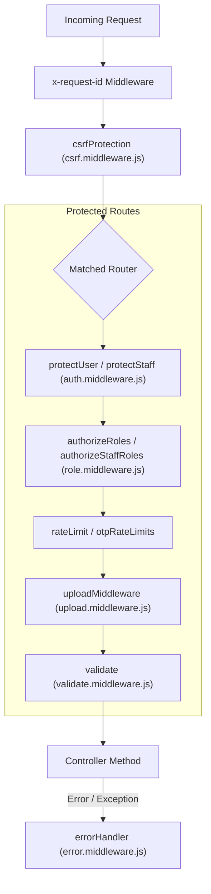

# 08. Middleware Documentation

## 1. Executive Summary

Middlewares in the Rovauto backend provide security boundaries, request isolation, session verification, CSRF validation, rate limiting, and standardized error transformation.

---

## 2. Global Middleware Execution Pipeline

---

## 3. Middleware Reference Directory

### 3.1 Authentication Middleware ([`middlewares/auth.middleware.js`](file:///Users/prateek/Roavuto/server/src/middlewares/auth.middleware.js))

- **File Size**: 11,642 bytes (~11.6 KB).
- **Exported Functions**:
  - `protectUser`: Extracts session token from signed HttpOnly cookie `user_session` or `Authorization: Bearer <token>`. Queries `UserSession` table and Redis cache. Attaches user record to `req.user`. If session is revoked or expired, clears cookie and throws `ApiError(401, "Authentication required")`. Rejects staff or garage sessions.
  - `protectStaff`: Resolves staff credentials from `StaffSession` and `StaffAccount`. Attaches `req.staff`.
  - `protectGarageOwner`: Resolves garage owner credentials from `GarageOwnerSession` and `GarageOwner`. Attaches `req.garageOwner`.
  - `protectGarageController`: Resolves controller credentials from `GarageControllerSession`. Attaches `req.garageController`.

---

### 3.2 Role Authorization Middleware ([`middlewares/role.middleware.js`](file:///Users/prateek/Roavuto/server/src/middlewares/role.middleware.js))

- **Exported Functions**:
  - `authorizeRoles(...allowedRoles)`: Higher-order middleware function. Compares `req.user.role` against `allowedRoles`. Throws `ApiError(403, "Access denied: insufficient permissions")` if role is not matched.
  - `authorizeStaffRoles(...allowedStaffRoles)`: Compares `req.staff.role` against staff roles (`ADMIN`, `SUB_ADMIN`, `INTERN`).

---

### 3.3 CSRF Protection Middleware ([`middlewares/csrf.middleware.js`](file:///Users/prateek/Roavuto/server/src/middlewares/csrf.middleware.js))

- **Exported Functions**:
  - `csrfProtection`: Implements double-submit CSRF verification for mutating HTTP methods (`POST`, `PUT`, `PATCH`, `DELETE`). Reads secret token from `x-csrf-token` cookie and compares with `X-CSRF-Token` request header using `crypto.timingSafeEqual()`.
  - `getCsrfToken`: Route handler for `GET /api/v1/csrf-token`. Generates a 32-byte cryptographically secure random token, sets the `x-csrf-token` cookie, and returns `{ csrfToken }` in JSON.

---

### 3.4 Rate Limiting & Concurrency Middlewares ([`middlewares/rateLimit.middleware.js`](file:///Users/prateek/Roavuto/server/src/middlewares/rateLimit.middleware.js), [`middlewares/otpRateLimit.middleware.js`](file:///Users/prateek/Roavuto/server/src/middlewares/otpRateLimit.middleware.js))

- **`rateLimit(options)`**: Redis-backed sliding-window rate limiter. Returns `429 Too Many Requests` when IP or custom key exceeds request quota.
- **`otpSendRateLimits`**: Strict double rate-limiter:
  1. Maximum 3 OTP requests per phone number per 10 minutes.
  2. Maximum 5 OTP requests per IP address per 15 minutes.
- **`concurrencyLimit(maxConcurrent)`**: Restricts concurrent executions of expensive operations (e.g. spatial searches or PDF generation).
- **`keyedConcurrencyLimit(keyGen, maxConcurrent)`**: Restricts concurrency per user ID or garage ID.

---

### 3.5 File Upload Middleware ([`middlewares/upload.middleware.js`](file:///Users/prateek/Roavuto/server/src/middlewares/upload.middleware.js))

- **Technology**: Built using `multer` with memory storage (`multer.memoryStorage()`).
- **Exported Middlewares**:
  - `uploadSingleMedia(fieldName)`: Handles single file uploads (max 10MB). Validates MIME type (`image/jpeg`, `image/png`, `image/webp`, `video/mp4`).
  - `uploadArray(fieldName, maxCount)`: Handles multiple file uploads up to `maxCount` (e.g. 10 garage application images).
  - `uploadFields(fieldsArray)`: Handles multi-field file inputs (e.g., identity proof + garage logo).

---

### 3.6 Error Handling Middleware ([`middlewares/error.middleware.js`](file:///Users/prateek/Roavuto/server/src/middlewares/error.middleware.js))

- **Purpose**: Global Express error handler `(err, req, res, next)`.
- **Transformation Logic**:
  1. If `err` is an instance of [`ApiError`](file:///Users/prateek/Roavuto/server/src/utils/apiError.js), returns `res.status(err.statusCode).json({ success: false, message: err.message, errors: err.errors })`.
  2. Handles Prisma Known Request Errors (`P2002` -> `409 Conflict`, `P2025` -> `404 Not Found`).
  3. Catches JWT invalid/expired errors -> `401 Unauthorized`.
  4. Automatically captures unhandled internal errors in `SystemIssue` via `systemIssueReporter.captureBackgroundError()`.
