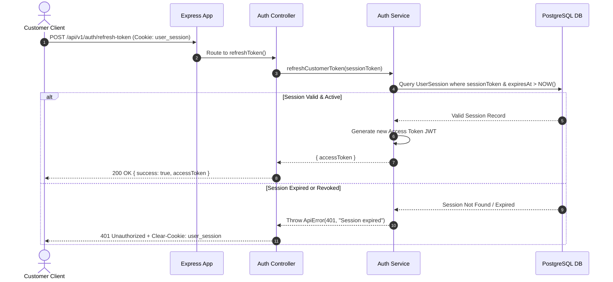
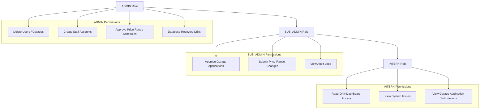

# 09. Authentication & Authorization Reference

## 1. Executive Summary

The Rovauto backend uses a **multi-actor session & token authentication model**. 

Browsers interact via secure, HttpOnly, SameSite-configured cookies backed by database session records (`UserSession`, `StaffSession`, `GarageOwnerSession`, `GarageControllerSession`). Mobile apps and external webhooks interact via JWT Bearer tokens in the `Authorization` header.

---

## 2. Cryptographic Security Standards

1. **Password Hashing**: Implemented via Argon2 (`argon2` v0.44.0).
   - Memory cost: `65536 KB` (64 MB)
   - Time cost: `3 iterations`
   - Parallelism: `4 threads`
   - Prevents GPU and ASIC brute-force attacks.
2. **Session Tokens**: 32-byte cryptographically secure random tokens generated via `crypto.randomBytes(32).toString("hex")`.
3. **JWT Signing**: Signed with HMAC-SHA256 (`jsonwebtoken`).
   - Access Token Expiry: 15 minutes (`JWT_EXPIRES_IN`).
   - Refresh Token Expiry: 7 days (`JWT_REFRESH_EXPIRES_IN`).

---

## 3. Actor Session Tables & Scope Hierarchy

| Actor Domain | Session Table | Primary Cookie Name | Auth Middleware | Role Hierarchy |
| :--- | :--- | :--- | :--- | :--- |
| **Customer** | `UserSession` | `user_session` | `protectUser` | `CUSTOMER` |
| **Garage Owner** | `GarageOwnerSession` | `garage_owner_session` | `protectGarageOwner` | `GARAGE_OWNER` |
| **Garage Controller**| `GarageControllerSession`| `garage_controller_session`| `protectGarageController`| `GARAGE_CONTROLLER` |
| **Staff Admin** | `StaffSession` | `staff_session` | `protectStaff` | `ADMIN` > `SUB_ADMIN` > `INTERN` |
| **Customer Support** | `CustomerSupportSession` | `customer_support_session` | `protectCustomerSupport` | `CUSTOMER_SUPPORT` |

---

## 4. Sequence Diagrams

### 4.1 Customer Login & Session Creation Flow

```mermaid
sequenceDiagram
    autonumber
    actor Customer as Customer Client
    participant App as Express App
    participant AuthCtrl as Auth Controller
    participant AuthSvc as Auth Service
    participant Argon as Argon2 Engine
    participant DB as PostgreSQL DB
    participant Redis as Redis Cache

    Customer->>App: POST /api/v1/auth/login { email, password }
    App->>AuthCtrl: Route to login()
    AuthCtrl->>AuthSvc: loginCustomer(email, password)
    AuthSvc->>DB: Find User by email
    DB-->>AuthSvc: User Record (includes passwordHash)
    AuthSvc->>Argon: verify(passwordHash, password)
    Argon-->>AuthSvc: Valid Password
    AuthSvc->>DB: Create UserSession (sessionToken, expiresAt)
    DB-->>AuthSvc: Created Session
    AuthSvc->>Redis: Cache session metadata (TTL 7 days)
    AuthSvc-->>AuthCtrl: { user, sessionToken, accessToken }
    AuthCtrl-->>Customer: 200 OK + Set-Cookie: user_session=<token>; HttpOnly; Secure
```

---

### 4.2 Refresh Token Flow



---

## 5. Staff Role-Based Access Control (RBAC) Hierarchy

The Staff domain enforces role-based restrictions using `authorizeStaffRoles()`:


