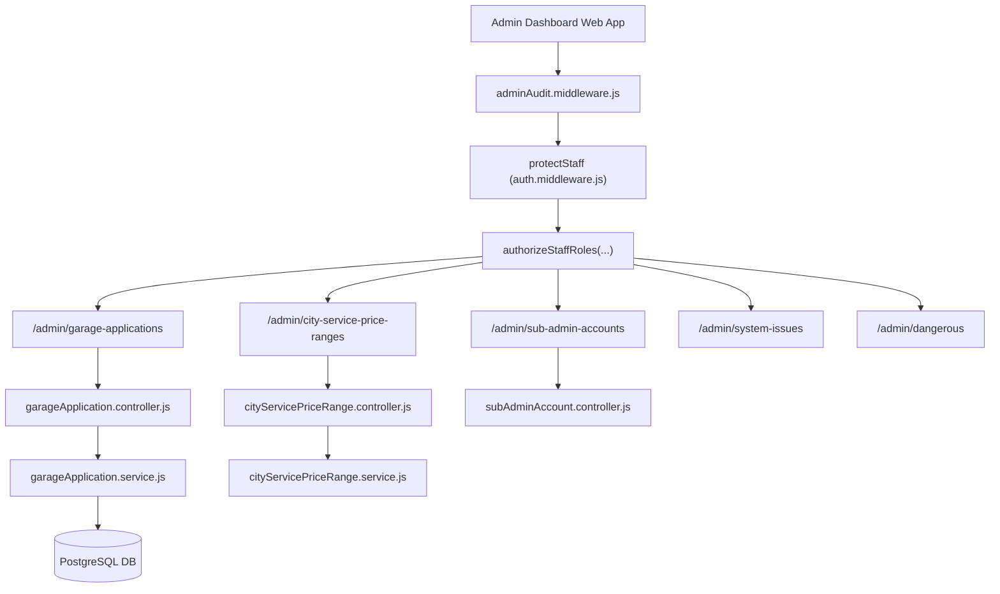

# 11. Admin Module Documentation

## 1. Executive Summary & Module Role

The **Admin Module** ([`server/src/admin/`](file:///Users/prateek/Roavuto/server/src/admin)) provides platform administrators, sub-admins, and interns with administrative controls over the Rovauto system.

### Key Capabilities:
- **Garage Partner Onboarding Review**: Reviewing pending garage applications, inspecting uploaded documents/photos, approving active status, or requesting changes.
- **City & Pricing Overrides**: Configuring city-level min/max service price bounds, creating scheduled price range updates, and approving schedule transitions.
- **Staff & Support Account Provisioning**: Provisioning staff accounts (`StaffAccount`), customer support accounts (`CustomerSupportAccount`), sub-admins, and intern accounts.
- **System Health & Audit Inspection**: Viewing immutable staff audit logs (`AdminAuditLog`), tracking captured background system issues (`SystemIssue`), and testing integration health.
- **Platform Pseudo-Data Controls**: Configuring marketing boost numbers for public homepage counters via singleton `PlatformPseudoData`.

---

## 2. Admin Architecture & Route Inventory

---

## 3. Key Sub-System Deep Dives

### 3.1 Garage Application Approval Engine ([`admin/services/garageApplication.service.js`](file:///Users/prateek/Roavuto/server/src/admin/services/garageApplication.service.js))

- **Workflow**:
  1. Interns/Admins inspect pending `GarageApplication` record.
  2. Upon calling `approveApplication(applicationId, approvalPayload)`:
     - Atomically creates `GarageOwner` account with a securely generated password.
     - Atomically creates `Garage` record with operational status `ACTIVE`, assigning specified `workingRadiusKm` and geolocation coordinates.
     - Atomically creates `GarageWallet` initialized to `0` balance.
     - Updates `GarageApplication.status` to `APPROVED` and links `approvedGarageId`.
     - Queues welcome credentials email in `GarageApplicationEmailOutbox`.

---

### 3.2 City Service Price Range Schedules ([`admin/controllers/cityServicePriceRange.controller.js`](file:///Users/prateek/Roavuto/server/src/admin/controllers/cityServicePriceRange.controller.js))

- **Purpose**: Prevents price gouging or extreme underpricing by setting min/max bounds per service, city, brand, model, and fuel type.
- **Scheduling Logic**:
  - Staff can submit a price range change with a `startsAt` and optional `endsAt` timestamp, stored in `PriceRangeSchedule`.
  - Background worker evaluates active schedules and promotes pending updates to `CityServicePriceRange`.

---

### 3.3 Audit Logging & Security ([`admin/middlewares/adminAudit.middleware.js`](file:///Users/prateek/Roavuto/server/src/admin/middlewares/adminAudit.middleware.js))

- **Immutable Audit Contract**:
  - Intercepts all staff HTTP requests that modify state (`POST`, `PUT`, `PATCH`, `DELETE`).
  - Logs `AdminAuditLog` record containing: `actorId`, `actorEmail`, `actorRole`, `action`, `resource`, `resourceId`, `method`, `path`, `statusCode`, `ipAddress`, and `metadata`.
  - Provides audit traceability for compliance and security drills.
