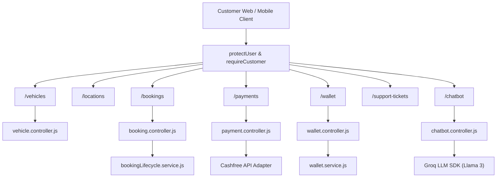

# 12. Customer Module Documentation

## 1. Executive Summary & Module Role

The **Customer Module** ([`server/src/customer/`](file:///Users/prateek/Roavuto/server/src/customer)) powers all user-facing customer features. It encapsulates vehicle management, location geocoding, garage discovery, service booking, Cashfree payments, wallet deposits/refunds, service tracking, reviews, complaints, and Groq-powered AI chatbot support.

---

## 2. Customer Sub-System Architecture

---

## 3. Key Sub-System Breakdown

### 3.1 Vehicle Garage Management ([`customer/controllers/vehicle.controller.js`](file:///Users/prateek/Roavuto/server/src/customer/controllers/vehicle.controller.js))

- **Models**: `Vehicle`, `VehicleBrand`, `VehicleModel`.
- **Functionality**:
  - Customers add vehicles specifying registration number, brand, model, fuel type (`PETROL`, `DIESEL`, `CNG`, `EV`), manufacturing year, and transmission type.
  - Validates registration number against Indian vehicle format regex (`/^[A-Z]{2}[0-9]{2}[A-Z]{1,2}[0-9]{4}$/`).
  - Implements default vehicle selection flag (`isDefault`). Setting a new default vehicle atomically sets `isDefault = false` on all other vehicles owned by the customer.

---

### 3.2 Customer Wallet & Ledger System ([`customer/services/wallet.service.js`](file:///Users/prateek/Roavuto/server/src/customer/services/wallet.service.js))

- **Models**: `Wallet`, `WalletTransaction`.
- **Financial Guarantees**:
  - Balances are stored as integers (in Paise or Rupees) to eliminate floating-point rounding errors.
  - Every modification to `Wallet.balance` requires a corresponding `WalletTransaction` entry (`CREDIT` or `DEBIT`).
  - Supports idempotency keys (`idempotencyKey`) on transactions to prevent double-debiting on network retries.
  - Auto-refund logic: Cancelling an eligible booking automatically credits the customer's wallet.

---

### 3.3 AI Chatbot Support Assistant ([`customer/controllers/chatbot.controller.js`](file:///Users/prateek/Roavuto/server/src/customer/controllers/chatbot.controller.js))

- **Technology**: Integration with **Groq SDK** (`groq-sdk` v1.3.0) using high-speed Llama 3 models.
- **Workflow**:
  1. Customer submits a message via `POST /api/v1/chatbot/message`.
  2. The service retrieves the active customer profile, current active booking status, and system knowledge context from [`customer/knowledge/`](file:///Users/prateek/Roavuto/server/src/customer/knowledge).
  3. Formats prompt with system guidelines and queries Groq API.
  4. Stores messages in `ChatbotConversation` and `ChatbotMessage` tables for conversation memory.
