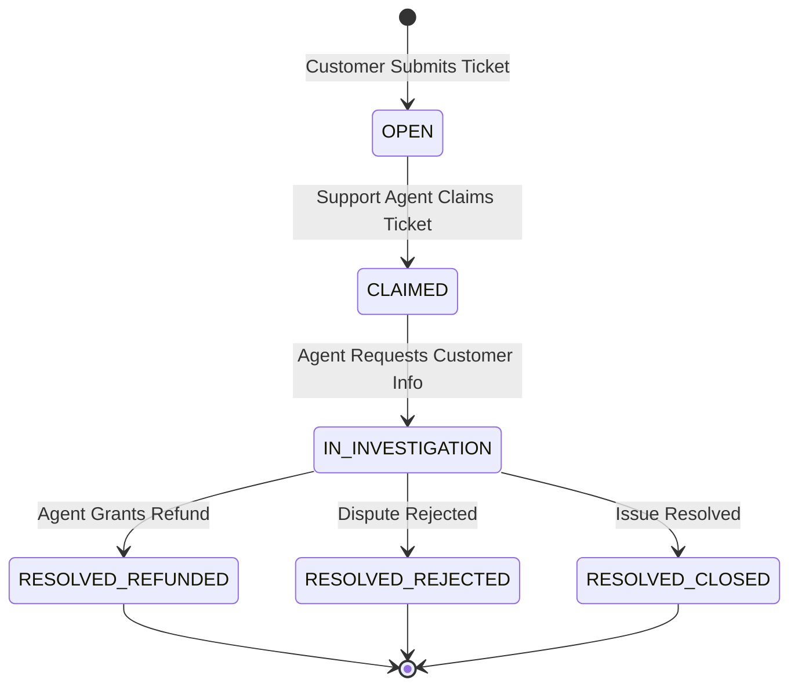
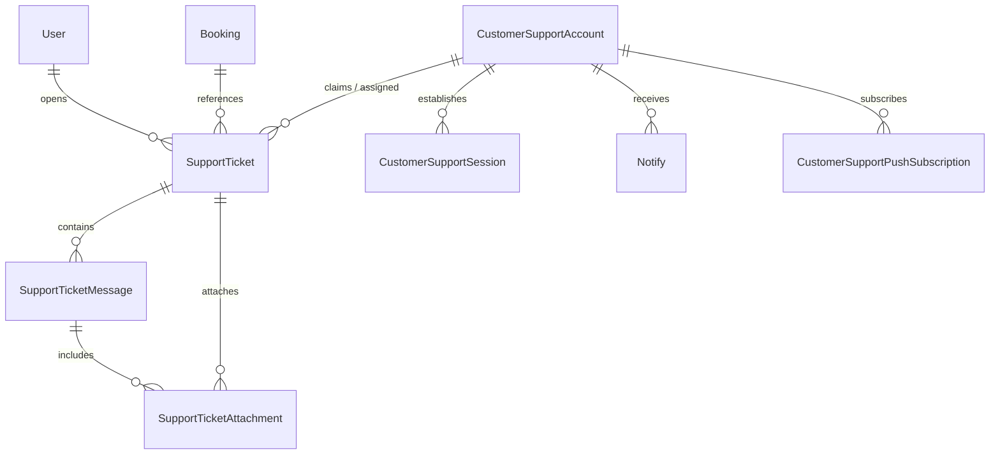

# 13. Customer Support Module Documentation

## 1. Executive Summary & Module Role

The **Customer Support Module** ([`server/src/customerSupport/`](file:///Users/prateek/Roavuto/server/src/customerSupport)) provides tools for customer support agents (`CustomerSupportAccount`) to manage support tickets, investigate complaints, resolve disputes, process customer refunds, and send targeted push/email notifications.

---

## 2. Support Ticket Lifecycle & Workflow

---

## 3. Data Models & Entity Relationships

---

## 4. Primary Controller & Service Reference

- **Controller**: [`customerSupport/controllers/customerSupport.controller.js`](file:///Users/prateek/Roavuto/server/src/customerSupport/controllers/customerSupport.controller.js)
- **Service**: [`customerSupport/services/customerSupport.service.js`](file:///Users/prateek/Roavuto/server/src/customerSupport/services/customerSupport.service.js)

### Key Capabilities:
1. `claimTicket(ticketId, supportAccountId)`: Atomically assigns `supportAssigneeId` and sets `claimedAt = NOW()`.
2. `addTicketMessage(ticketId, messagePayload)`: Supports public messages (visible to customer) and internal notes (`isInternal = true`, hidden from customer).
3. `resolveTicketWithRefund(ticketId, refundAmount, note)`: Atomically issues a refund to the customer's `Wallet` via `walletService`, updates ticket status to `RESOLVED`, and records resolution outcome.
4. `sendAgentPushNotification(supportAccountId, payload)`: Sends VAPID web push notifications to the agent's active browser endpoints.
