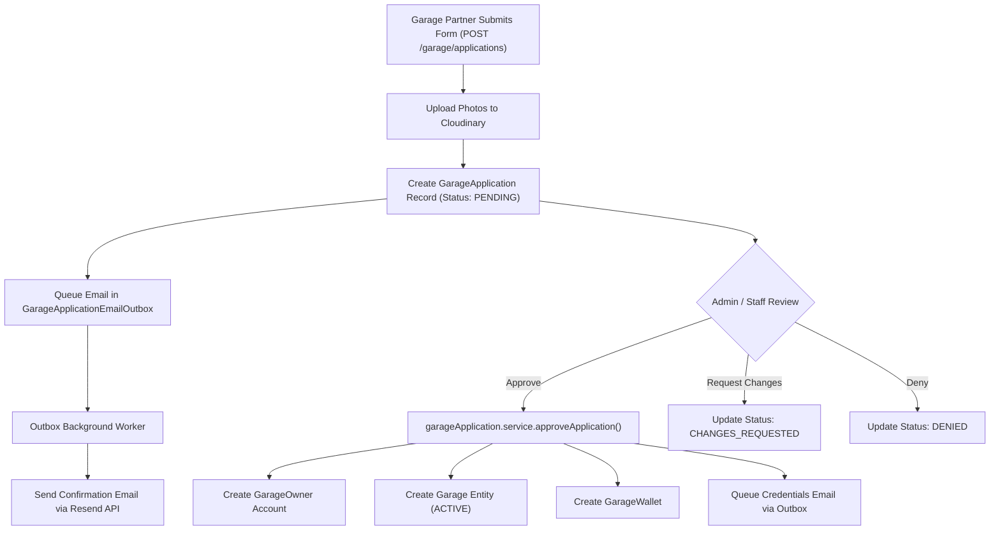
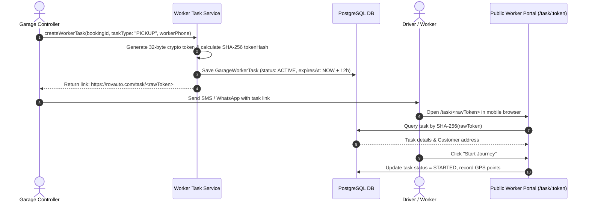

# 14. Garage Module Documentation

## 1. Executive Summary & Module Role

The **Garage Module** ([`server/src/garage/`](file:///Users/prateek/Roavuto/server/src/garage)) manages all garage partner operations. It powers partner onboarding applications, owner/controller authentication, broadcast request dispatches, active booking execution, worker task tokenization, garage media management, and revenue wallet management.

---

## 2. Onboarding & Application Processing Pipeline

---

## 3. Dual Auth Model: Owner vs. Controller

Garages support two distinct operational personas:
1. **`GarageOwner`**: Business owner. Manages payout account details, views analytics, manages controller credentials, and configures garage working hours. Authenticates via email/password or OTP.
2. **`GarageController`**: On-site terminal operator or shop manager. Operates on tablet/desktop terminals to view incoming broadcasts, accept jobs, assign workers, and record inspection photos. Authenticates via numeric `loginId` and PIN/password.

---

## 4. Worker Task Tokenization & Logistics Flow

---

## 5. Garage Wallet & Earnings Settlement

- **Models**: `GarageWallet`, `GarageWalletTransaction`.
- **Earnings Allocation**:
  - Upon booking completion (`status = COMPLETED`), `bookingLifecycleService` calculates platform fee deduction (e.g. 10%) and credits net earnings to the garage's `GarageWallet`.
  - Generates immutable `GarageWalletTransaction` record with transaction type `EARNING`.
