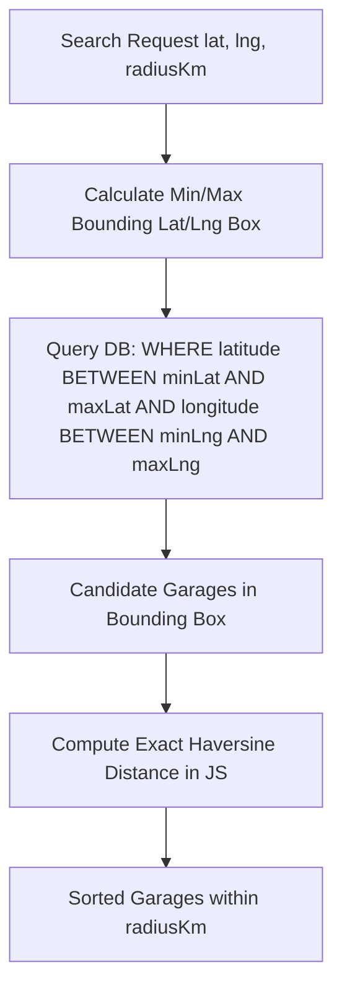

# 15. Maps Module Documentation

## 1. Executive Summary & Module Role

The **Maps Module** ([`server/src/maps/`](file:///Users/prateek/Roavuto/server/src/maps)) provides spatial location capabilities, distance calculations, reverse geocoding, and radius-based garage discovery algorithms.

---

## 2. Spatial Algorithms & Distance Formula

### 2.1 Haversine Great-Circle Distance Calculation
Implemented in [`utils/distance.js`](file:///Users/prateek/Roavuto/server/src/utils/distance.js):

$$\text{haversine}(a, b) = 2 R \arcsin \left( \sqrt{ \sin^2 \left( \frac{\Delta \phi}{2} \right) + \cos(\phi_1) \cos(\phi_2) \sin^2 \left( \frac{\Delta \lambda}{2} \right) } \right)$$

Where:
- $R = 6371 \text{ km}$ (Earth's mean radius).
- $\phi_1, \phi_2$ are latitudes in radians.
- $\Delta \phi, \Delta \lambda$ are latitude and longitude differences in radians.

```javascript
// Reference implementation from src/utils/distance.js
function calculateDistanceKm(lat1, lon1, lat2, lon2) {
  const R = 6371; // Radius of Earth in km
  const dLat = toRad(lat2 - lat1);
  const dLon = toRad(lon2 - lon1);
  const a =
    Math.sin(dLat / 2) * Math.sin(dLat / 2) +
    Math.cos(toRad(lat1)) * Math.cos(toRad(lat2)) *
    Math.sin(dLon / 2) * Math.sin(dLon / 2);
  const c = 2 * Math.atan2(Math.sqrt(a), Math.sqrt(1 - a));
  return R * c;
}
```

---

### 2.2 Bounding-Box Query Optimization

To avoid computing Haversine distance for every garage in the database, the spatial search uses a two-phase query pattern:



---

## 3. Reverse Geocoding & Address Correction Helper

- **File**: [`utils/addressCorrection.js`](file:///Users/prateek/Roavuto/server/src/utils/addressCorrection.js).
- **Purpose**: Cleans raw geocoded text returned from maps APIs, formats Indian pincodes, extracts city/area names, and sanitizes street addresses.
